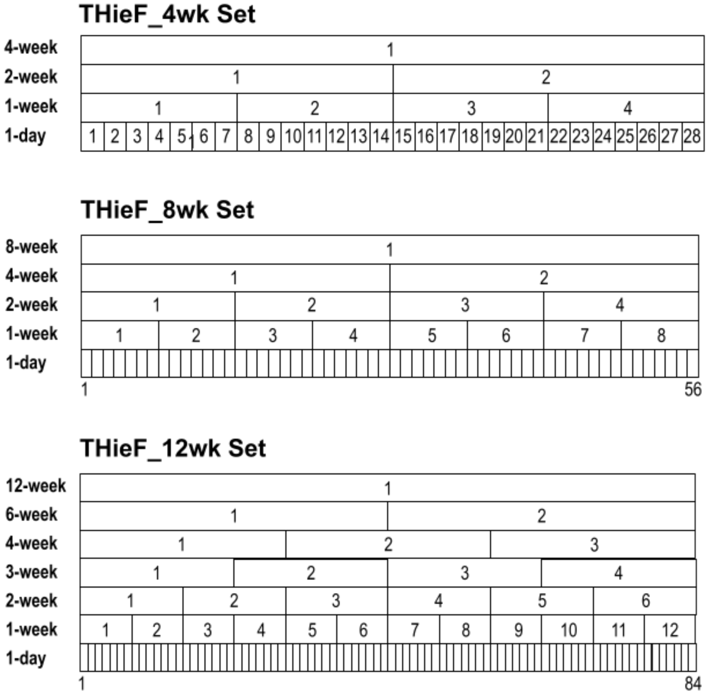

---
title:
author:
date:
output: pdf_document
indent: true
fontsize: 12pt
header-includes:
    - \usepackage{setspace}
    - \usepackage{indentfirst}
---

```{r setup, include=FALSE}
knitr::opts_chunk$set(echo = FALSE)
library(thief)
library(forecast)
library(lubridate)
library(tidyverse)
library(zoltr)
library(covidHubUtils)
library(stringr)
library(patchwork)
library(knitr)
library("captioner")
```

\doublespacing

# Introduction
The COVID-19 pandemic has underscored how infectious disease outbreaks can strain public health, clinical, and economic institutions. This has highlighted the importance of infectious disease forecasting as a way for the scientific community to communicate information, both to policymakers and to the general public, about potential future directions of the pandemic.   

Outbreaks of other transmissible diseases like dengue, ebola, SARS, and influenza have also seen substantial forecasting efforts to reduce their spread and wider impact, modelers making quantitative predictions about the future based on already-observed data. These predictions may pertain to a specific event, outcome, or trend related to one (or occasionally more) infectious disease (Lauer, 2020). In this way, decisions that balance prevention or mitigation with economic or societal loss can be made much more effectively (Smith, 2019). For example, healthcare staffing and allocation of limited resources may be determined by any forecasted trends. Targeted communication campaigns about social distancing or vaccination may also be scheduled ahead of any forecasted increases in order to be most effective. Similarly, lockdowns may be eased during a forecasted downward trend to help boost the economy.   

COVID-19 forecasts (and infectious disease forecasts in general) tend to be short-term, predicting up to no more than four weeks ahead. Further, this type of forecast is quantifiable and specific for a fixed period of time (e.g. one week ahead, two weeks ahead, etc.) and can therefore be evaluated by comparing the forecasts to the eventually observed data. Although longer-term COVID-19 scenario projections that predict further out into the future under specified hypothetical conditions are useful in making more lasting plans for combating infectious disease, only short-term COVID-19 forecasts are explored in this work.   

Short-term COVID-19 forecasting has been heavily researched with efforts synthesized, collected, archived, and evaluated in a centralized repository called the US COVID-19 Forecast Hub [https://covid19forecasthub.org/]. COVID-19 forecasts have also been in the form of probabilistic forecasts rather than point forecasts. The use of probabilistic forecasts is a distinguishing characteristic of outbreak forecasting efforts, as this type of forecast provides more information. For example, probabilistic forecasts quantify the likelihood of their occurrence.   

However, producing accurate forecasts is not an easy task. One challenge is that the systems that govern the spread of infectious diseases tend to be non-stationary processes since they are partially dependent on human behavior (Lauer, 2020). For COVID-19, this non-stationarity was caused by continually changing policies and behaviors due to school closures, lockdowns, masking, social distancing, and the appearance of new variants. This makes trends difficult to forecast. Another challenge is that COVID-19 forecasts were used to inform those changing policies, further complicating matters due to the forecasting feedback loop. The forecasting feedback loop describes a paradox that occurs when infectious disease forecasts guide intervention or risk communication and thus impacts the path of the epidemic being forecast (Cramer, 2021; Lauer, 2020).   

Forecasting COVID-19 has also seen the additional challenge of an emergent outbreak setting, in which data availability and quality is severely limited (Lauer, 2020). This was especially true at the beginning of the pandemic, but a lack of a national testing protocol and issues properly categorizing deaths has meant that models often still do not have accurate data to train on. As a result, incident hospitalizations have started to become a more relevant public health metric compared to incident cases and incident deaths, despite its initially fewer forecasting efforts, making it an appropriate forecast target to explore going forward.   

Recent research about COVID-19 forecasting has also shown that most models have trouble predicting change-points in which trends in the data change direction (that is, hospitalizations start to increase or decrease in a way that is different from the previous pattern) (Cramer, 2021). Not only that, despite a range in data sources and modeling techniques, many models do not assign probability to the potential of a large change in trend. This gap calls for the exploration and testing of new methods.   

Temporal Hierarchical Forecasting (THieF) created by Athanasopoulos et al in 2017 is a novel method that combines hierarchical forecasting and temporal aggregation for time series. This approach consists of three main steps: creation of a temporal hierarchy through data aggregation, generation of forecasts at every level of the hierarchy using a classical statistical model, and reconciliation of those forecasts. The final step performs weighted forecast combination to not only achieve coherence but also improved accuracy (Athanasopoulos, 2017). Coherence describes when hierarchical forecasts predict the same trend, event, or outcome at every level; reconciliation is the process of making forecasts coherent. If forecasts are not coherent, it is unclear which level of forecasts should be trusted and chosen over other levels (Kourentzes, 2021).   

In light of the above-mentioned challenges within infectious disease forecasting, THieF might have something to offer. First, the THieF methodology relies on a phenomenological model, and for short-term outbreak forecasting, despite the growing body of knowledge we have about the mechanisms underlying disease transmission, models that focus only on the observed data, without incorporating a mechanistic understanding of outbreaks, often show good performance. Second, to my knowledge, THieF has not been applied in outbreak forecasting previously, meaning that it might offer insight about effective modeling techniques, regardless of its performance. Third, THieF has shown significant performance gains in other settings, which may translate to infectious disease forecasting.   

The THieF methodology is used to retrospectively create probabilistic forecasts for COVID-19 incident daily hospitalizations for the United States at the state and national level. Six models are created based on the THieF methodology using an ARIMA base forecaster, and then were compared against each other and a naive baseline model during the training phase to identify the most accurate models. Success is demonstrated by a few models shown to have accuracy gains when compared to the baseline. All of these forecasts are implemented through R using the package THieF made available by Athanasopoulos *et al* (2017).   


# Methods
## Data
The data used in this analysis is the HealthData.gov COVID-19 Reported Patient Impact and Hospital Capacity by State Timeseries which reports daily incident hospitalizations for all 50 states, several US territories, and the aggregated U.S. national level. The sources of this state-aggregated time series are HHS TeleTracking, state/territorial health department reports to HHS Protect, and (prior to July 15, 2020) National Healthcare Safety Network. The COVID-19 Forecast Hub [https://covid19forecasthub.org/] designated this data set as the official ground truth data for COVID-19 incident hospitalizations on December 1, 2020 for modeling teams to train with and for models to be compared against. Reporting for hospitalizations was sporadic during the early stages of the pandemic and only became consistent for all locations in late July 2020. However, once hospitalization reporting became required for Medicare reimbursement, hospitalization data became much more reliable than case and death data, which continue to suffer from major underreporting issues.   

```{r, message=FALSE, warning=FALSE}
full_hosp_truth <- load_truth("HealthData", 
                         "inc hosp", 
                         temporal_resolution="weekly",
                         data_location = "remote_hub_repo")
```

## Forecast quantiles
As specified by the COVID-19 Forecast Hub, the 23 quantiles $$Q = \{.010, 0.025, .050, .100, \cdots, .900, .950, .990\}$$ are used to represent a single forecast’s probabilistic distribution with the median 0.50 quantile typically taken as the point forecast. However, instead of specifying a full probabilistic distribution, I narrow the scope to make interval forecasts whose bounds can be used to obtain the desired 23 quantiles instead. The following table summarizes the translation from prediction interval bounds to quantiles, where “L” indicates the lower bound of a prediction interval while “U” indicates the upper bound.    

\singlespacing

```{r, message=FALSE, warning=FALSE}
Quantile <- c(".010", ".025", ".050", "0.100", "0.150", "...", "0.500", "...", "0.900", "0.950", ".975", ".990")
Interval <- c("98L", "95L", "90L", "80L", "70L", "...", "Median", "...", "80U", "90U", "95U", "98U")
quant_int_table <- rbind(Quantile, Interval)
knitr::kable(quant_int_table, caption="Summary of the required 23 quantiles and their associated prediction interval bound. The values in the Quantile row are the quantile from the probabilistic distribution of the model generating the forecasts. The values in the Interval row are the uncertainty of the prediction interval while the “L” or “U” indicates an upper or lower bound, respectively.", col.names=NULL)
```

\doublespacing

## Forecast locations 
Forecasts are made for all 50 states, Washington DC, Puerto Rico, and the US as a whole with a forecast horizon up to 84-day ahead incident hospitalizations, depending on the forecasting model (see Model Specifications below). Other US territories such as American Samoa and Guam are not included due to their very low or zero COVID-19 incident hospitalizations over the course of the pandemic. Forecasts that predicted single digit or even zero daily hospitalizations for these locations were often very accurate, meaning that these locations do not add much to understanding of differences in forecast skill between different modeling approaches (Cramer, 2021).   

## Date range of analysis 
The period of analysis was initially defined to be 462 days (66 weeks) long, starting on Monday, July 27, 2020 and ending Monday, November 1, 2021. This time period was split into a 343 day (49 week) training phase that ends on Monday, July 5, 2021 and a 119 day (17 week) testing phase that ends on Monday, November 1, 2021. The division is based on including two waves (the winter 2020-21 and the Alpha variant) of the pandemic in the training phase and one (Delta variant) in the testing phase. July 27, 2020 marked the beginning of when the forecast locations of interest had reliable truth data. However, only the training phase analysis is included in this thesis to avoid preemptively looking at the testing phase data; further work will contain testing phase analysis.   

\vspace{1cm}

```{r, fig.cap="Overview of the period of analysis included in the paper, superimposed over COVID-19 incident hospitalizations for the entire United States. Vertical dashed lines indicate divisions between phases. The training phase begins on Monday, July 27, 2020 and ends on Monday, July 5, 2021. This phase covers 343 days, or 49 weeks. Forecasts for the training phase are made starting on Monday, December 7, 2020. The testing phase, although not included in this paper, begins Tuesday, July 6, 2021 and ends Monday, November 1, 2021. The division is based on including two waves (the Winter 2020-21 and the Alpha variant) of the pandemic in the training phase and one (Delta variant) in the testing phase. July 27, 2020 marks the beginning of when the forecast locations of interest had reliable truth data."}
hosp_truth_US <- full_hosp_truth %>%
  filter(location == "US", 
         target_end_date >= as.Date("2020-07-27"), target_end_date <= as.Date("2021-12-01"))
         
ggplot(data = hosp_truth_US, aes(x = target_end_date, y = value)) + geom_line() + 
  geom_vline(xintercept = as.Date("2020-07-27"), linetype="dashed", color = "blue") +
  geom_vline(xintercept = as.Date("2020-12-07"), linetype="dashed", color = "blue") +
  geom_vline(xintercept = as.Date("2021-07-05"), linetype="dashed", color = "purple") +
  geom_vline(xintercept = as.Date("2021-11-01"), linetype="dashed", color = "red") +
  annotate(geom = "text", x = as.Date("2021-01-01"), y = 2000, 
           label = "Training Phase", size = 7, color = "blue") + 
  annotate(geom = "text", x = as.Date("2021-03-18"), y = 100, 
           label = "Training Forecasts", size = 4, color = "#72b6ff") + # change color
  annotate(geom = "text", x = as.Date("2021-09-04"), y = 2000, 
           label = "Testing", size = 7, color = "red") + 
    scale_x_date(name=NULL, date_breaks = "2 month", minor_breaks = "1 month",
                 date_labels = "%b '%y") + 
    ylim(c(0, NA)) +
    theme(axis.ticks.length.x = unit(0.25, "cm"),  
          axis.text.x = element_text(vjust = 1, hjust = 0.5),
          legend.position = "none") + 
  labs(title = "COVID-19 US National Hospitalizations",
       x = "date", y = "incident hospitalizations (daily)")
```


\newpage

### Training/validation and testing
The training phase is used to fit candidate models (see Model Specification subsection below) to the data, which are used to make forecasts between December 7th 2020 and July 5th 2021. (December 7th 2020 is the first Monday after the HealthData.gov incident hospitalizations dataset was designated the official ground truth data.) The training phase also serves as a validation period in which three models are chosen to move on to the test phase. All training period evaluations will consist of forecasts with target end dates made for July 5, 2021 and earlier.   

Two of the models will be the overall best based on forecast accuracy during the training phase while the remaining model will be the single best model in terms of forecast accuracy during the last 12 weeks of the training phase, following the rule of only evaluating forecasts with target end dates before the end of the training period. This selection rule is to account for any models that perform better with more data to train on, as they will have this greater amount of data to help inform their forecasts during the testing phase.   

## Temporal hierarchical forecasting
Hierarchical forecasting has historically been utilized in business, economics, operations management, and related fields. This type of forecasting has seen useful advantages like producing coherent forecasts and has enjoyed certain accuracy gains. Forecast combination, too, has been applied in a myriad of settings with favorable outcomes. The unique merging of these techniques in the THieF methodology has led to its promising accuracy improvements over more traditional hierarchical forecasting that does not involve forecast combination (Athanasopoulos, 2017).  

These improvements over conventional methods can be attributed to its use of forecast combination (Athanasopoulos, 2017). THieF's forecast combination, while different from that of ensemble methods which combine forecasts from different, independent modeling frameworks, shares certain similarities which may indicate it could also show increased accuracy when forecasting COVID-19. Research has also shown that classical statistical models often show good performance for short-term outbreak forecasting, suggesting another aspect of this methodology that may be beneficial.   

Infectious disease data collected at a daily level is often noisy due to reporting artifacts; COVID-19 shows a day of the week effect as a result of hospital and clinic operating hours. Fewer hospitalizations are reported on the weekends and instead get recorded in Monday hospitalizations because patients are not admitted on Saturday or Sunday. Aggregating daily data to a weekly, or even bi-weekly (every other week), level can provide a smoothing effect that allows for better capture of true short-term trends. THieF's inclusion and combination of both daily and weekly and bi-weekly levels strikes a balance between smoothing and including any useful information of the daily level. Higher aggregation levels are also included in model schemes to investigate whether a hidden pattern exists at higher time scales and if such a pattern could improve model accuracy.   

As previously mentioned, THieF is a three-step method for forecasting time-series data using a time-based hierarchical structure. These steps (outlined in more detail below) consist of data aggregation, base forecast creation, and reconciliation of the base forecasts.   

The first step in using the THieF methodology is to create the hierarchical structure. Time-series data of a particular time scale can be aggregated into the desired levels of the hierarchy, where the original time scale defines the lowest temporal level (Athanasopoulos, 2017). For example, a three-level hierarchy can be created from a quarterly time series in which the data is aggregated to semi-annual and annual levels. Although in this case all the levels feed neatly into each other, the only other restriction on the temporal hierarchy is that all of the levels must be factors of the top-level (Athanasopoulos, 2017). Returning to the example, by considering the aggregation levels in terms of months, it can be seen that all of the levels (3-month, 6-month, 12-month) are all factors of the topmost level. Other temporal scales (in terms of months) that could be added to the hierarchy could be any other factors of 12.

Next, a classic statistical modeling approach is used to make the base forecasts at every level of the hierarchy. Athanasopoulos et al (2017) test both ETS and ARIMA approaches, with ARIMA shown to be more accurate. Based on these results, I choose to only use ARIMA based forecasters for all of my models. The model is fit to each aggregation level separately, as if they were separate time series, meaning that the order and values of parameters are allowed to vary. Hence, at this stage the forecasts are usually not coherent (Athanasopoulos, 2017). 

Finally, these forecasts are optimally combined to obtain the reconciled forecasts. A simplified weighted least squares (WLS) estimator is used for this process (Athanasopoulos, 2017). The series variance scaling WLS estimator is used for the reconciliation process to determine the appropriate weights for each level of base forecasts. Forecasts with less variance of “reconciliation error” (the difference between base forecasts and their expected value if they were reconciled) are favored in this process (Athanasopoulos, 2017).   

For my work on forecasting COVID-19 incident hospitalizations, the 4-week set of time scales consists of 1-day, 7-day, 14-day, and 28-day. These can also be thought of as daily, weekly, 2-weekly, and 4-weekly, and will be referred to as such in the rest of this thesis for convenience (see Figure 2). Each aggregation level can be thought of as a univariate time series from which forecasts can be made. Next, a classical statistical model is used to make these base forecasts. These consist of forecasts of up to 84-day ahead incident hospitalizations, depending on the forecasting model (although only up to 28-day ahead forecasts are evaluated).   

I use the automatically generated prediction intervals from the `forecast` package to obtain the values for the 23 quantiles specified earlier (see Table 1 above). Then I optimally combine these base forecasts to obtain reconciled forecasts using the series variance scaling estimator defined by Athanasopoulos *et al* (2017). This estimator determines the amount of weight to give the forecasts of each aggregation level when they are combined and reconciled based on the variance of their estimated in-sample forecast errors. 

It is important to note that the original THieF method created by Athanasopoulos *et al* (2017) is only defined for point forecasting. Further work on this methodology developed by Taieb (2017) and Gamakumara (2018) expands THieF to probabilistic forecasting; however, these developments were deemed beyond the scope of this thesis due to their complexity. Instead, prediction intervals are used in place of fully specifying a probabilistic distribution (see Forecast Quantiles). Additional discussion can be found in Conclusions/Discussion.   


##  Model specifications
During the training/validation phase, I compare several different specifications for the candidate models. Various combinations of modeling frameworks and timescale sets for the temporal hierarchies are used to generate the candidate models. More specifically, I test three hierarchical structures and two data transformations, resulting in six total candidate models.   

Three different sets of time scales for the aggregation levels within the temporal hierarchy are explored in this work. The THieF_4wk set of time scales consist of daily, weekly, 2-weekly, and 4-weekly. The THieF_8wk set is made up of the THieF_4wk set plus an additional 8-weekly level that serves as the new topmost level. The THieF_12wk set adds 3-weekly, 6-weekly, and (topmost) 12-weekly time scales together in addition to the THieF_4wk set. Note that the lower levels of each hierarchy are all factors of that hierarchy's top level, an essential component to the THieF method.   

```{r, fig.cap="Illustrations of the three hierarchy schemes used to create the THieF models. THieF-4wk consists of daily, weekly, 2-weekly, and 4-weekly time scales, THieF-8wk consists of the same THieF-4wk time scales plus a topmost 8-weekly level, and THieF-12wk consists of the THieF-4wk time scales plus THieF-4wk set of time scales consist of daily, weekly, 2-weekly, and 4-weekly. All lower levels of each hierarchy are factors of the top level of that hierarchy, an essential component to the THieF method.", fig.line = 'center'}

```

Additionally, each of these hierarchy schemes is explored with both no data transformation and a variance-stabilizing fourth-root data transformation. The latter transformation is chosen based on previous research by the Reich Lab at UMass Amherst which has shown accuracy improvements when using a fourth root transformation for forecasting COVID-19.   


## Metrics and evaluation  
The evaluation is conducted through several different aggregation schemes: horizon, forecast date, location, pandemic wave (when applicable), and overall. Although incident hospitalizations are observed and forecasted at a daily level, I choose to evaluate the forecasts on a weekly basis. This is the standard in the monthly evaluation reports from the COVID-19 Forecast Hub and is computed by averaging the values for the metric of choice across a single week (Tuesday through Monday) to obtain a single value for that week. The aggregation scheme based on horizon, location, and pandemic wave will also be calculated similarly by averaging values by week.  

I use the same three metrics as the COVID-19 Forecast Hub: average MAE for point forecasts and average WIS and average PI coverage for probabilistic forecasts. (For simplicity, these are referred to simply as MAE, WIS, and PI coverage going forward.) Relative versions of MAE and WIS are also used when applicable, and are calculated as $MAE_{\textrm{model m}} / MAE_{\textrm{baseline}}$ and $WIS_{\textrm{model m}} /WIS_{\textrm{baseline}}$, respectively. Equations for these metrics are taken from Cramer *et al* (2021) and are shown below:   

\singlespacing

1. $MAE = \frac{1}{N} \Sigma_{i=1}^N |y_i-\hat{y_i}|$   
2. $WIS_{{\alpha}_{0:K}} (F, y_i) = \frac{1}{N} \Sigma_{i=1}^N \frac{1}{K+1/2}(w_0\cdot |y_i - m| + \Sigma_{k = 1}^K w_k \cdot IS_{{\alpha}_k}(F, y_i))$   
3. $PI \textrm{ } Coverage = \frac{1}{N} \Sigma_{i=1}^N 1(l_i^{\alpha} \leq y_i \leq u_i^{\alpha})$   

\doublespacing

where $N$ is the number of forecasts being averaged, $y_i$ is the true observed value at a particular time point (date) and location, and $\hat{y}_i$ is point forecast (0.5 quantile) value for a particular target end date and location. Cramer *et al* (2021) also define $\alpha$ as the PI uncertainty level, $k$ as the particular prediction interval ($k = 1, \cdots, K$), and $F$ as the forecast distribution. The weights $w_0$ and $w_k$ are set as $w_0 = 1/2$ and $w_k = \alpha_k/2$ respectively while $u_i^{\alpha}$ and $l_i^{\alpha}$ are the upper and lower bounds of an $\alpha$-level prediction interval for a target end date particular date and location. Lastly, the interval score of a particular $\alpha$-level prediction interval is $IS_{{\alpha}_k}(F, y_i) = (u_i-l_i) + \frac{2}{\alpha} \cdot (l_i-y_i) \cdot 1(y_i < l_i) + \frac{2}{\alpha} \cdot (y_i - u_i) \cdot 1(y_i > u_i)$ where $1()$ is the indicator function.   

This evaluation was initially intended to be performed both during the training/validation and testing phases separately, but only the training/validation phase analysis is provided here. The two phases are separated based on a forecast date of July 5th 2021. However, as mentioned previously, the final forecasts for the training period can only be evaluated using data within the date range of the training phase, meaning that forecasts for that period are truncated such that the target end date must also be within the training phase as well.   

The training/validation evaluation compares the six models against each other as well as the naive baseline model created by the COVID-19 Forecast Hub, and this evaluation determines which three models to move on to the testing phase. (The testing phase will be conducted in further work and will involve a more in-depth accuracy evaluation and comparison with other models that forecast COVID-19 incident hospitalizations and submit to the COVID-19 Forecast Hub.)   

No statistical tests are performed to assess the significance of differences in performance between models due to certain issues when forecasting time series that prevent the use of such tests. Namely, scores are usually highly correlated across many dimensions, like horizons, forecast dates, locations, and more. Standard inference tends to make assumptions that the data/forecasts are i.i.d (independent and identically distributed), but these assumptions are invalid in such a case.   


# Results
For every evaluation following the overall model performance, I evaluate performance at each horizon week separately, as important differences in accuracy arise at different horizons. Further, I also evaluate the US national level separately from the state/territory level given the significant differences in scale between values and due to the fact that the former is a sum of the latter. The performance for the state/territory level is averaged across all locations.   

```{r}
load("../data/loadedfc_scores_df.RData")
load("../data/baseline_fc_scores.RData")

# Rename models
forecasts_df <-forecasts_df %>%
  mutate(
    model=
      case_when(
        str_detect(model, "Base_arima_")~str_replace(model, "Base_arima_", "THieF_4wk-"),
        str_detect(model, "Topmost8_arima_")~str_replace(model, "Topmost8_arima_", "THieF_8wk-"),
        str_detect(model, "Multiple3_arima_")~str_replace(model, "Multiple3_arima_", "THieF_12wk-")
       )
  )
  
scores_df <-scores_df %>%
  mutate(
    model=
      case_when(
        str_detect(model, "Base_arima_")~str_replace(model, "Base_arima_", "THieF_4wk-"),
        str_detect(model, "Topmost8_arima_")~str_replace(model, "Topmost8_arima_", "THieF_8wk-"),
        str_detect(model, "Multiple3_arima_")~str_replace(model, "Multiple3_arima_", "THieF_12wk-")
       )
  )
```

## Overall model performance

```{r, warning=FALSE, message=FALSE, fig.cap='The time series of daily incident hospitalizations at the US national level with overlaid 1 to 28 day ahead forecasts, each made 28 days apart, from 3 models: the COVIDhub-baseline, a poor-performing THieF model (THieF-12wk-noTrans), and a top-performing THieF model (THieF-4wk-4root). The two THieF models can be seen to generally have narrower prediction intervals compared to the baseline. The THieF-4wk-4root forecasts tend to follow the true hospitalization trends, especially during times of low incidents, and is usually more accurate than the THieF-12wk-noTrans forecasts.'}
fdat <- forecasts_df %>% 
  rbind(forecasts_baseline) %>%
  filter(location == "US", 
        horizon <= 28,
        forecast_date %in% c(as.Date("2020-12-07") + weeks(4*(0:7))))
  
p <- plot_forecasts(fdat, 
                    target_variable = "inc hosp", 
                    models = c("THieF_4wk-4root", "COVIDhub-baseline", "THieF_12wk-noTrans"),
                    intervals = c(.5, .95), 
                    truth_source = "HealthData",
                    use_median_as_point = TRUE,
                    facet = model ~.,
                    facet_nrow = 3,
                    #facet_scales = "free_y",
                    fill_by_model = TRUE, 
                    plot=FALSE,
#                    title = "Incident Hospitalization Forecasts at the National Level for Three Models",
                    subtitle="",
                    show_caption = FALSE)

p + scale_x_date(name=NULL, limits=c(as.Date("2020-10-01"), as.Date("2021-07-05")), 
                date_breaks = "2 months", date_labels = "%b") +
  scale_y_continuous(limits=c(0, 28000)) +
  theme(axis.ticks.length.x = unit(0.5, "cm"),
        axis.text.x = element_text(vjust = 7, hjust = -0.2),
        legend.position = "right")
```

Figure 3 displays some example 1 to 28 day ahead forecasts from a poor-performing THieF model (THieF-12wk-noTrans) and a top-performing THieF model (THieF-4wk-4root) for the US national level, plotted with forecasts from the COVIDhub-baseline for comparison. The two THieF models generally have narrower prediction intervals compared to the baseline. The THieF-4wk-4root forecasts better follow the hospitalization trends compared to the THieF-12wk-noTrans forecasts, especially during times of low incidence. The chosen two models are generally representative of the performance of the other THieF models and the models perform similarly for other locations.   

For the US national level (see Table 2), the THieF_4wk-4root and THieF_4wk-noTrans models take the lead for forecast accuracy and show better performance than the naive baseline for all metrics except 95% PI coverage. In terms of WIS, the THieF_4wk-4root model performs the best with a relative WIS value of 0.924 and a relative MAE value of 0.938, meaning it had 7.6% and 6.2% improvements over the baseline. The WIS improvement over the baseline is largely due to the model's narrower prediction intervals as seen in Figure 3. This model also had 30.3% and 81.0% coverage rates for 50% and 95% prediction intervals, respectively, the former slightly closer to the nominal coverage rate than the baseline. In terms of 50% coverage rate, THieF_4wk-noTrans performed the best with a 50% coverage rate of 40.7% and a 95% coverage rate of 83.9%, the former a decent amount closer to the nominal coverage rate then the baseline. This model also had a 0.965 relative WIS and 0.937 relative MAE, or 3.5% and 6.3% improvements over the baseline. The other models show poorer performance compared to the baseline, with the THieF_8wk-4root and THieF_8wk-noTrans models performing about equally or worse than the baseline but the THieF_12wk-4root and THieF_12wk-noTrans models performing substantially worse than the baseline.   

For the aggregated states level (see Table 3), there is much greater similarity between the THieF_4wk and THieF_8wk-4root and THieF_8wk-noTrans models in terms of all metrics. These models show more substantial improvements over the baseline compared to that for the US national level for all metrics except for relative MAE, for which even the best models perform slightly worse than the baseline. The THieF_4wk-4root model performs the best for all metrics except for 95% PI coverage, although it is a very close third best in terms of being closest to the nominal coverage rate. This model has a relative WIS of 0.873 (12.7% improvement over the baseline), 1.007 relative MAE (0.7% worse than the baseline), 47.8% 50% PI coverage (the baseline has an 88.8% 50% coverage rate) and 91.6% 95% PI coverage (the baseline achieves a 100% 95% coverage rate). The THieF_8wk-4root model has similar relative WIS and relative MAE values (but worse coverage rates) while the THieF_8wk-noTrans model has similar coverage rates (but worse relative WIS and relative MAE). The THieF_12wk-4root and THieF_12wk-noTrans models show certain improvements in coverage rates but do not show the same number of improvements over the baseline as the other for models.   

\singlespacing

```{r, message=FALSE, warning=FALSE}
# US National
overall_metrics_US <- scores_df %>%
  rbind(score_baseline) %>%
  filter(horizon <= 28, 
         target_end_date <= as.Date("2021-07-05"),
         location == "US") %>%
  group_by(model) %>%
  summarize(
    wis = mean(wis), mae=mean(abs_error),
    cov_50 = mean(coverage_50),
    cov_95 = mean(coverage_95)
  ) 
overall_metrics_US <- overall_metrics_US %>%
  mutate(
    rwis = wis/pull(overall_metrics_US[1, 2]),
    rmae = mae/pull(overall_metrics_US[1, 3])
  ) %>% 
  mutate(across(where(is.numeric), round, digits=3)) %>%
  arrange(wis)
knitr::kable(overall_metrics_US, caption="Summary of overall model performance for the US national level, aggregated across forecast week and 1 to 4 week ahead horizons. Prediction interval (PI) coverage rates measure the fraction of times the fraction of times the 50% and 95% PIs covered the true values. A well-calibrated model should achieve close to nominal (0.5 and 0.95, respectively) coverage rates. The “rwis” and “rmae” show relative weighted interval score and relative mean absolute error, which compare each model to the baseline. The baseline is defined to have relative metrics of 1. Models that perform better than the baseline have relative WIS or MAE less than 1. The table is ordered by ascending WIS value. Thus two THieF-4wk models show the best performance out of the THIEF models, meeting the baseline for both relative WIS and MAE.")

models <- pull(overall_metrics_US, model)   
```

```{r, message=FALSE, warning=FALSE}
# States
overall_metrics_states <- scores_df %>%
  rbind(score_baseline) %>%
  filter(horizon <= 28, 
         target_end_date <= as.Date("2021-07-05"),
         location != "US") %>%
  group_by(model) %>%
  summarize(
    wis = mean(wis), mae=mean(abs_error),
    cov_50 = mean(coverage_50),
    cov_95 = mean(coverage_95)
  ) 
overall_metrics_states <- overall_metrics_states %>%
  mutate(
    rwis = wis/pull(overall_metrics_states[1, 2]),
    rmae = mae/pull(overall_metrics_states[1, 3])
  ) %>% 
  mutate(across(where(is.numeric), round, digits=3)) %>%
  arrange(wis)
knitr::kable(overall_metrics_states, caption="Summary of overall model performance averaged over the states level. A similar ordering of models is seen, with the THieF-4wk-4root model performing the best and the THieF-12wk models performing the worst. However, the THieF-8wk models perform better in terms of model ranking for the states level. Additionally, relative WIS sees smaller values and 50% and 95% PI coverage see values closer to the nominal levels compared to that at the US national level, although relative MAE is larger with every model performing worse than the baseline.")
```

\doublespacing

## Model performance by horizon week
Similar patterns in model accuracy are seen when forecasts are aggregated by horizon week for the US national level (see Table 4 in Supplemental Tables). Only poor-performing models showed worse WIS and MAE values at a 1-week ahead horizon. Meanwhile, all models had worse relative performance compared to the baseline at the same 1-week ahead horizon (see Figure 4). This is likely due to the models being overconfident at this horizon, as evidenced by their low PI coverage rates (see Table 4 in Supplemental Tables). The THieF_4wk-4root and THieF_4wk-noTrans models once again generally show the best performance of the six models, especially at smaller horizons with THieF_8wk-4root and THieF_8wk-noTrans models performing similarly or better at a 4 week ahead horizon for certain metrics. The THieF_4wk-4root model performs better at smaller horizons while the THieF_4wk-noTrans model generally performs better at longer horizons. We see improved performance over the baseline for different metrics at different horizons for the THieF_4wk-4root and THieF_4wk-noTrans and THieF_8wk-4root and THieF_8wk-noTrans models, although no improvement is shown for 95% PI coverage for any of the models. In fact, all of the models show poor 95% PI coverage compared to the baseline.   

Likewise for the aggregated states level, similar trends in model accuracy are seen in terms of model ranking when forecasts are stratified by horizon week compared to when no such stratification is performed (see Table 5 in Supplemental Tables). The greatest improvements over the baseline are seen in coverage rates, especially the 95% PI coverage, although the 50% PI coverage shows every model beating the baseline in terms of coverage rates closer to the nominal rate. This coverage rate improvement over the baseline at the states level is striking when compared to the US national level. On the other hand, only the THieF_8wk models show improved performance at the state level for every metric over the US national level while the THieF_4wk-4root model only shows improve performance at the state level for relative WIS. However, that all four THieF_4wk-4root and THieF_4wk-noTrans and THieF_8wk models show improvement over the baseline for their relative WIS values for 2, 3, and 4 week ahead horizons.   

```{r, message=FALSE, warning=FALSE}
# US National
horizon_wk_metrics_US <- scores_df %>%
  rbind(score_baseline) %>%
  filter(horizon <= 28, 
         target_end_date <= as.Date("2021-07-05"),
         location == "US") %>%
  mutate(
    horizon_wk = case_when(
      horizon %in% c(1:7) ~ 1,
      horizon %in% c(8:14) ~ 2,
      horizon %in% c(15:21) ~ 3,
      horizon %in% c(22:28) ~ 4
    )
  ) %>%
  group_by(model, horizon_wk) %>%
  summarize(
    wis = mean(wis), mae=mean(abs_error),
    cov_50 = mean(coverage_50),
    cov_95 = mean(coverage_95)
  ) 
horizon_wk_metrics_US <- horizon_wk_metrics_US %>%
  mutate(
    rwis = case_when(
      horizon_wk == 1 ~ wis / pull(horizon_wk_metrics_US[1,3]),
      horizon_wk == 2 ~ wis / pull(horizon_wk_metrics_US[2,3]),
      horizon_wk == 3 ~ wis / pull(horizon_wk_metrics_US[3,3]),
      horizon_wk == 4 ~ wis / pull(horizon_wk_metrics_US[4,3])
    ),
    rmae = case_when(
      horizon_wk == 1 ~ mae / pull(horizon_wk_metrics_US[1,4]),
      horizon_wk == 2 ~ mae / pull(horizon_wk_metrics_US[2,4]),
      horizon_wk == 3 ~ mae / pull(horizon_wk_metrics_US[3,4]),
      horizon_wk == 4 ~ mae / pull(horizon_wk_metrics_US[4,4])
    )
  ) %>% 
  mutate(across(where(is.numeric), round, digits=3)) %>%
  arrange(horizon_wk, wis)


# Aggregated for all states and territories
horizon_wk_metrics_states <- scores_df %>%
  rbind(score_baseline) %>%
  filter(horizon <= 28, 
         target_end_date <= as.Date("2021-07-05"),
         location != "US") %>%
  mutate(
    horizon_wk = case_when(
      horizon %in% c(1:7) ~ 1,
      horizon %in% c(8:14) ~ 2,
      horizon %in% c(15:21) ~ 3,
      horizon %in% c(22:28) ~ 4
    )
  ) %>%
  group_by(model, horizon_wk) %>%
  summarize(
    wis = mean(wis), mae=mean(abs_error),
    cov_50 = mean(coverage_50),
    cov_95 = mean(coverage_95)
  ) 
horizon_wk_metrics_states <- horizon_wk_metrics_states %>%
  mutate(
    rwis = case_when(
      horizon_wk == 1 ~ wis / pull(horizon_wk_metrics_states[1,3]),
      horizon_wk == 2 ~ wis / pull(horizon_wk_metrics_states[2,3]),
      horizon_wk == 3 ~ wis / pull(horizon_wk_metrics_states[3,3]),
      horizon_wk == 4 ~ wis / pull(horizon_wk_metrics_states[4,3])
    ),
    rmae = case_when(
      horizon_wk == 1 ~ mae / pull(horizon_wk_metrics_states[1,4]),
      horizon_wk == 2 ~ mae / pull(horizon_wk_metrics_states[2,4]),
      horizon_wk == 3 ~ mae / pull(horizon_wk_metrics_states[3,4]),
      horizon_wk == 4 ~ mae / pull(horizon_wk_metrics_states[4,4])
    )
  ) %>% 
  mutate(across(where(is.numeric), round, digits=3)) %>%
  arrange(horizon_wk, wis)
```

```{r, message=FALSE, warning=FALSE, fig.cap='Average WIS by the horizon week for each model for the US national level and the states level. The figures show similar trends in WIS when forecasts are stratified by horizon week compared to being aggregated across horizon weeks. All models show worse performance relative to the baseline at the 1-week ahead horizon, likely a result of being overconfident at this horizon. Once again, the THieF-4wk-4root model performs the best for WIS. Plots for average MAE are not shown due to their similarity to the average WIS plots.'}  
wis_hzn_plot_US <- horizon_wk_metrics_US %>%
ggplot(mapping=aes(x=horizon_wk, y=wis, group=model)) +
  geom_point(mapping=aes(col=model), alpha=0.5) +
  geom_line(mapping=aes(col=model), alpha=0.5) +
  scale_color_manual(
    breaks = c(models[4], models[1:3], models[5:7]),
    values = c("black", "red", "darkorange",
      "green", "blue", "purple", "magenta")) +
  labs(title="US",
       x="Horizon Week", y="Average WIS")
              
wis_hzn_plot_states <- horizon_wk_metrics_states %>%
  ggplot(mapping=aes(x=horizon_wk, y=wis, group=model)) +
  geom_point(mapping=aes(col=model), alpha=0.5) +
  geom_line(mapping=aes(col=model), alpha=0.5) +
  scale_color_manual(
    breaks = c(models[4], models[1:3], models[5:7]),
    values = c("black", "red", "darkorange",
      "green", "blue", "purple", "magenta")) +
  labs(title="States", 
       x="Horizon Week", y="Average WIS")
              
wis_hzn_plot_US + wis_hzn_plot_states +
  plot_layout(ncol = 2, guides='collect') &
  theme(legend.position='bottom')
```


## Model performance by wave
For the US national level (see Table 6 in Supplemental Tables for full results), both waves yet again saw the THieF_12wk-4root and THieF_12wk-noTrans models performing worse at a 1-week ahead horizon compared to longer horizons while all models performed worse relative to the baseline at the same 1-week ahead horizon due to overconfidence. This is shown in Figure 5. Notably, most models performed better during the alpha wave in terms of every metric except relative MAE, likely due to the fact that the number of hospitalizations were smaller and thus had less variance. Once again, there tended to be worse coverage rates for the 95% PI compared to the 50% PI. During the alpha wave, the THieF_4wk-4root model showed the most improvements over the baseline in terms of relative WIS and MAE at every horizon, with between nearly 20% and 38% improvements for WIS and the third best coverage rates with some improvements over the baseline. The THieF_4wk-noTrans and THieF_8wk-noTrans models were the two best performing for coverage rate, beating the baseline for every horizon at the 50% level and matching it at the 95% level. During the winter21 wave, the two THieF_4wk-4root and THieF_4wk-noTrans models performed similarly, each performing the best for different horizons and different metrics. Generally, the THieF_4wk-4root model performed better for shorter horizons while the THieF_4wk-noTrans model performed better for longer horizons. Interestingly, at longer horizons the covidTHieF_12wk-noTrans model achieved some of the best relative WIS and MAE values of the winter21 wave, being between 10% and 19% better than the baseline despite poor performance in other instances.    

For the states level (see Table 7 in Supplemental Tables for full results), there is somewhat of a someone of a similar trend of the worst performance relative to the baseline at 1-week ahead, although it is much less pronounced than that of the US national level (see Figure 5). The 95% coverage rates are also less poor compared to the US national level. During the alpha wave, the THieF_4wk-4root model similarly shows the most improvements over the baseline in terms of relative WIS and MAE at every horizon, with between close to 30% and 45% improvements for WIS and the best coverage rates with large improvements over the baseline except for one week ahead 95% coverage which was equal to that of the baseline. The THieF_4wk-noTrans model didn't always have the best performance across the four metrics but it was one of the top performing models that had consistent improvements over the baseline. The THieF_8wk-noTrans model showed some very competitive coverage rates that improved over the baseline for 50% coverage at every horizon but also had some instances of performing worse than the baseline for 95% coverage. During the winter21 wave, the two THieF_4wk-4root and THieF_4wk-noTrans models performed more similarly, though the THieF_4wk-4root model performed slightly better overall. In addition, the THieF_8wk-4root and THieF_8wk-noTrans models showed smaller relative WIS and relative MAE values compared to the THieF_4wk-4root and THieF_4wk-noTrans models performed for longer horizons. Interestingly, at longer horizons the THieF_12wk-noTrans model also achieved some of the best relative WIS and MAE values of the winter21 wave, being up to just over 10% better than the baseline despite poor performance in other instances.   

```{r, message=FALSE, warning=FALSE}  
# US National
wave_metrics_US <- scores_df %>%
  rbind(score_baseline) %>%
  filter(horizon <= 28, 
         target_end_date <= as.Date("2021-07-05"),
         location == "US") %>%
  mutate(
    horizon_wk = case_when(
      horizon %in% c(1:7) ~ 1,
      horizon %in% c(8:14) ~ 2,
      horizon %in% c(15:21) ~ 3,
      horizon %in% c(22:28) ~ 4
    ),
    wave = case_when(
      forecast_date <= as.Date("2021-03-17") ~"winter21",
      forecast_date >= as.Date("2021-03-17") ~"alpha"
    )
  ) %>%
  group_by(wave, model, horizon_wk) %>%
  summarize(
    wis = mean(wis), mae=mean(abs_error),
    cov_50 = mean(coverage_50),
    cov_95 = mean(coverage_95)
  ) 
wave_metrics_US <- wave_metrics_US %>%
  mutate(
    rwis = case_when(
      horizon_wk == 1 & wave == "alpha" ~ wis / pull(wave_metrics_US[1, 4]),
      horizon_wk == 2 & wave == "alpha" ~ wis / pull(wave_metrics_US[2,4]),
      horizon_wk == 3 & wave == "alpha" ~ wis / pull(wave_metrics_US[3,4]),
      horizon_wk == 4 & wave == "alpha" ~ wis / pull(wave_metrics_US[4,4]),
      horizon_wk == 1 & wave == "winter21" ~ wis / pull(wave_metrics_US[29,4]),
      horizon_wk == 2 & wave == "winter21" ~ wis / pull(wave_metrics_US[30,4]),
      horizon_wk == 3 & wave == "winter21" ~ wis / pull(wave_metrics_US[31,4]),
      horizon_wk == 4 & wave == "winter21" ~ wis / pull(wave_metrics_US[32,4])
    ),
    rmae = case_when(
      horizon_wk == 1 & wave == "alpha" ~ mae / pull(wave_metrics_US[1, 5]),
      horizon_wk == 2 & wave == "alpha" ~ mae / pull(wave_metrics_US[2, 5]),
      horizon_wk == 3 & wave == "alpha" ~ mae / pull(wave_metrics_US[3, 5]),
      horizon_wk == 4 & wave == "alpha" ~ mae / pull(wave_metrics_US[4, 5]),
      horizon_wk == 1 & wave == "winter21" ~ mae / pull(wave_metrics_US[29, 5]),
      horizon_wk == 2 & wave == "winter21" ~ mae / pull(wave_metrics_US[30, 5]),
      horizon_wk == 3 & wave == "winter21" ~ mae / pull(wave_metrics_US[31, 5]),
      horizon_wk == 4 & wave == "winter21" ~ mae / pull(wave_metrics_US[32,5])
    )
  ) %>% 
  mutate(across(where(is.numeric), round, digits=3)) %>%
  arrange(wave, horizon_wk, wis)

# Aggregated for all states and territories
wave_metrics_states <- scores_df %>%
  rbind(score_baseline) %>%
  filter(horizon <= 28, 
         target_end_date <= as.Date("2021-07-05"),
         location != "US") %>%
  mutate(
    horizon_wk = case_when(
      horizon %in% c(1:7) ~ 1,
      horizon %in% c(8:14) ~ 2,
      horizon %in% c(15:21) ~ 3,
      horizon %in% c(22:28) ~ 4
    ),
    wave = case_when(
      forecast_date <= as.Date("2021-03-17") ~"winter21",
      forecast_date >= as.Date("2021-03-17") ~"alpha"
    )
  ) %>%
  group_by(wave, model, horizon_wk) %>%
  summarize(
    wis = mean(wis), mae=mean(abs_error),
    cov_50 = mean(coverage_50),
    cov_95 = mean(coverage_95)
  ) 
wave_metrics_states <- wave_metrics_states %>%
  mutate(
    rwis = case_when(
      horizon_wk == 1 & wave == "alpha" ~ wis / pull(wave_metrics_states[1,4]),
      horizon_wk == 2 & wave == "alpha" ~ wis / pull(wave_metrics_states[2,4]),
      horizon_wk == 3 & wave == "alpha" ~ wis / pull(wave_metrics_states[3,4]),
      horizon_wk == 4 & wave == "alpha" ~ wis / pull(wave_metrics_states[4,4]),
      horizon_wk == 1 & wave == "winter21" ~ wis / pull(wave_metrics_states[29,4]),
      horizon_wk == 2 & wave == "winter21" ~ wis / pull(wave_metrics_states[30,4]),
      horizon_wk == 3 & wave == "winter21" ~ wis / pull(wave_metrics_states[31,4]),
      horizon_wk == 4 & wave == "winter21" ~ wis / pull(wave_metrics_states[32,4])
    ),
    rmae = case_when(
      horizon_wk == 1 & wave == "alpha" ~ mae / pull(wave_metrics_states[1,5]),
      horizon_wk == 2 & wave == "alpha" ~ mae / pull(wave_metrics_states[2,5]),
      horizon_wk == 3 & wave == "alpha" ~ mae / pull(wave_metrics_states[3,5]),
      horizon_wk == 4 & wave == "alpha" ~ mae / pull(wave_metrics_states[4,5]),
      horizon_wk == 1 & wave == "winter21" ~ mae / pull(wave_metrics_states[29,5]),
      horizon_wk == 2 & wave == "winter21" ~ mae / pull(wave_metrics_states[30,5]),
      horizon_wk == 3 & wave == "winter21" ~ mae / pull(wave_metrics_states[31,5]),
      horizon_wk == 4 & wave == "winter21" ~ mae / pull(wave_metrics_states[32,5])
    )
  ) %>% 
  mutate(across(where(is.numeric), round, digits=3)) %>%
  arrange(wave, horizon_wk, wis)
```  
  
```{r, message=FALSE, warning=FALSE, fig.cap='Average WIS by the horizon week and pandemic wave for each model for the US national level and the states level. The figures show similar trends in WIS when forecasts are stratified by horizon week and pandemic wave compared to being stratified only across horizon week. Again, all models show worse performance relative to the baseline at the 1-week ahead horizon likely due to being overconfident at this horizon. Model performance is more similar among the top four models during the Alpha wave compared to during the Winter21 wave. Notably, although the THieF-4wk-4root models largely show the lowest WIS, longer horizons during the Winter21 wave saw better performance by the poor-performing THieF-12wk models. Plots for average MAE are not shown due to their similarity to the average WIS plots.'}
wis_hzn_plot_winter21_US <- wave_metrics_US %>%
  filter(wave == "winter21") %>%
  ggplot(mapping=aes(x=horizon_wk, y=wis, group=model)) +
   geom_point(mapping=aes(col=model), alpha=0.5) +
   geom_line(mapping=aes(col=model), alpha=0.5) +
  scale_color_manual(
    breaks = c(models[4], models[1:3], models[5:7]),
    values = c("black", "red", "darkorange",
      "green", "blue", "purple", "magenta")) +
   labs(title="Winter '21 Wave (US)", x="Horizon Week", y="Average WIS")
   
wis_hzn_plot_alpha_US <- wave_metrics_US %>%
  filter(wave == "alpha") %>%
  ggplot(mapping=aes(x=horizon_wk, y=wis, group=model)) +
   geom_point(mapping=aes(col=model), alpha=0.5) +
   geom_line(mapping=aes(col=model), alpha=0.5) +
  scale_color_manual(
    breaks = c(models[4], models[1:3], models[5:7]),
    values = c("black", "red", "darkorange",
      "green", "blue", "purple", "magenta")) +
   labs(title="Alpha Wave (US)", x="Horizon Week", y="Average WIS")
   
wis_hzn_plot_winter21_states <- wave_metrics_states %>%
  filter(wave == "winter21") %>%
  ggplot(mapping=aes(x=horizon_wk, y=wis, group=model)) +
   geom_point(mapping=aes(col=model), alpha=0.5) +
   geom_line(mapping=aes(col=model), alpha=0.5) +
  scale_color_manual(
    breaks = c(models[4], models[1:3], models[5:7]),
    values = c("black", "red", "darkorange",
      "green", "blue", "purple", "magenta")) +
   labs(title="Winter '21 Wave (states)", x="Horizon Week", y="Average WIS")

wis_hzn_plot_alpha_states <- wave_metrics_states %>%
  filter(wave == "alpha") %>%
  ggplot(mapping=aes(x=horizon_wk, y=wis, group=model)) +
   geom_point(mapping=aes(col=model), alpha=0.5) +
   geom_line(mapping=aes(col=model), alpha=0.5) +
  scale_color_manual(
    breaks = c(models[4], models[1:3], models[5:7]),
    values = c("black", "red", "darkorange",
      "green", "blue", "purple", "magenta")) +
   labs(title="Alpha Wave (states)", x="Horizon Week", y="Average WIS")
   
wis_hzn_plot_winter21_US + wis_hzn_plot_alpha_US + 
  wis_hzn_plot_winter21_states + wis_hzn_plot_alpha_states +
  plot_layout(ncol = 2, guides='collect') &
  theme(legend.position='bottom')
```


## Model Performance by Week
For the US national level, except for some poor performance at the start, the THieF_4wk-4root and THieF_4wk-noTrans models show lower or comparable WIS to the baseline across most of the training period with a forecast horizon of one week ahead. The THieF_8wk-4root and THieF_8wk-noTrans models show mostly comparable WIS to the baseline while the THieF_12wk-4root and THieF_12wk-noTrans models show mostly higher WIS than the baseline for a one week ahead horizon during the entire training period. On the other hand, for a four week ahead horizon the THieF_4wk-4root and THieF_4wk-noTrans models show only comparable WIS to the baseline not during change points. A very similar graph shape to that of the actual values for incident hospitalizations is observed. Meanwhile, for four week ahead horizons the THieF_12wk-4root and THieF_12wk-noTrans models show comparable WIS to the baseline not during phases of low incidence, often showing comparable or even better performance compared to the baseline during change points. Once again, the THieF_8wk-4root and THieF_8wk-noTrans models show intermediate performance between the other two groups of models.   

Very similar patterns are observed for one week ahead and four week ahead US national level forecasts in terms of MAE, although the best models (the two THieF_4wk-4root and THieF_4wk-noTrans ones) only tend to perform about comparably to the baseline, unlike for WIS. The weekly 95% PI coverage rate plots show more stable coverage rates at the 4-week ahead horizon compared to that out the 1-week ahead horizon. Except for the baseline, most models show very variable coverage up until a forecast date around February 2021, some weeks hitting full coverage while others falling short for most forecast days. Similarly, most models do not show good coverage rates at a 4-week ahead horizon until that February 2021 cut off date. For both 1-week ahead and 4-week ahead horizons, the models without a data transformation tend to see consistently high or even 100% coverage for the 95% PI while the models with a fourth root transformation do not meet nominal coverage rates during certain periods. These do not quite line up with change points seen in incident hospitalizations.   

For the states level aggregation, the same patterns are observed as for the US national level for 1 week ahead and 4 week ahead WIS and MAE, with strangely large four week ahead WIS values for the THieF_12wk-4root model. The weekly 95% PI coverage rate plots are more informative for the states level since they are an average across 52 locations, and they look like upside down versions of the weekly WIS plots. For the 1-week ahead horizon, the THieF_4wk-4root and THieF_4wk-noTrans models and the THieF_8wk-noTrans model show improved and fairly stable coverage starting in February 2021, likely due to smaller variance in incident values. For 4-week ahead horizon, all of the models without a data transformation seem to do the best starting from February 2021 with decent performance from THieF_4wk-4root and THieF_8wk-4root after the downward winter21 change point.   

```{r, message=FALSE, warning=FALSE, fig.cap='Average h-week ahead WIS and 95% PI coverage for each model for the US national level. Model performance differs from week to week: the WIS is the lowest during weeks with stable and low incident hospitalization values. The THieF-4wk models show the best performance with lower or comparable WIS to the baseline during the majority of the training period with especially good performance for 1-week ahead horizons. Meanwhile, the THieF-12wk showed lower or comparable WIS to the baseline during high incidence and changed points, which have been historically found difficult to forecast accurately. Plots for h-week ahead MAE are not shown due to their similarity to the WIS plots. All THieF models show very variable coverage rates, especially for a 1 week ahead horizon, only the models without a data transformation showing stable coverage starting around February 2021.'}  
# US National
forecast_date_metrics_US <- scores_df %>%
  filter(horizon <= 28, 
         target_end_date <= as.Date("2021-07-05"),
         location == "US") %>%
  select(model, horizon, forecast_date, target_end_date, true_value, abs_error, wis, coverage_50, coverage_95) %>%
  mutate(
    horizon_wk = case_when(
      horizon %in% c(1:7) ~ 1,
      horizon %in% c(8:14) ~ 2,
      horizon %in% c(15:21) ~ 3,
      horizon %in% c(22:28) ~ 4
    )
  ) %>%
  group_by(forecast_date, model, horizon_wk) %>%
  summarize(
    wis = mean(wis), mae=mean(abs_error),
    cov_50 = mean(coverage_50),
    cov_95 = mean(coverage_95)
  )

baseline_fc_date_metrics_US <- score_baseline %>%
  filter(horizon <= 28, 
         target_end_date <= as.Date("2021-07-05"),
         location == "US") %>%
  select(model, horizon, forecast_date, target_end_date, 
        true_value, abs_error, wis, coverage_50, coverage_95) %>%
  mutate(
    horizon_wk = case_when(
      horizon %in% c(1:7) ~ 1,
      horizon %in% c(8:14) ~ 2,
      horizon %in% c(15:21) ~ 3,
      horizon %in% c(22:28) ~ 4
    )
  ) %>%
  group_by(forecast_date, model, horizon_wk) %>%
  summarize(
    wis = mean(wis), mae=mean(abs_error),
    cov_50 = mean(coverage_50),
    cov_95 = mean(coverage_95)
  )

# WIS
wis_1wk_plot_US <- forecast_date_metrics_US %>%
  rbind(baseline_fc_date_metrics_US) %>%
  filter(horizon_wk == 1) %>%
  ggplot(aes(x = forecast_date, y = wis)) +
  geom_line(aes(color=model), alpha = 0.5) +
  geom_point(aes(color=model), alpha=0.5, size=0.75) +
  scale_x_date(name=NULL, date_breaks = "1 month", date_labels = "%b") + 
  scale_color_manual(
    breaks = c(models[4], models[1:3], models[5:7]),
    values = c("black", "red", "darkorange",
      "green", "blue", "purple", "magenta")) +
  labs(title = "WIS (1-week)") +
  theme(axis.ticks.length.x = unit(0.1, "cm"),
        axis.text.x = element_text(vjust = 2, hjust = -0.2),
        legend.position = 'bottom')

wis_4wk_plot_US <- forecast_date_metrics_US %>%
  rbind(baseline_fc_date_metrics_US) %>%
  filter(horizon_wk == 4) %>%
  ggplot(aes(x = forecast_date, y = wis)) +
  geom_line(aes(color=model), alpha = 0.5) +
  geom_point(aes(color=model), alpha=0.5, size=0.75) +
  scale_x_date(name=NULL, date_breaks = "1 month", date_labels = "%b") + 
  scale_color_manual(
    breaks = c(models[4], models[1:3], models[5:7]),
    values = c("black", "red", "darkorange",
      "green", "blue", "purple", "magenta")) +
  labs(title = "WIS (4-week)") +
  theme(axis.ticks.length.x = unit(0.1, "cm"),
        axis.text.x = element_text(vjust = 2, hjust = -0.2),
        legend.position = 'bottom')


# 95% PI Coverage
cov95_1wk_plot_US <- forecast_date_metrics_US %>%
  rbind(baseline_fc_date_metrics_US) %>%
  filter(horizon_wk == 1) %>%
  ggplot(aes(x = forecast_date, y = cov_95)) +
  geom_line(aes(color=model), alpha = 0.5) +
  geom_point(aes(color=model), alpha=0.5, size=0.75) +
  geom_hline(aes(yintercept=0.95)) +
  scale_x_date(name=NULL, date_breaks = "1 month", date_labels = "%b") + 
  scale_color_manual(
    breaks = c(models[4], models[1:3], models[5:7]),
    values = c("black", "red", "darkorange",
      "green", "blue", "purple", "magenta")) +
  labs(title = "95% PI Coverage (1-week)") +
  theme(axis.ticks.length.x = unit(0.1, "cm"),
        axis.text.x = element_text(vjust = 2, hjust = -0.2),
        legend.position = 'bottom')  

cov95_4wk_plot_US <- forecast_date_metrics_US %>%
  rbind(baseline_fc_date_metrics_US) %>%
  filter(horizon_wk == 4) %>%
  ggplot(aes(x = forecast_date, y = cov_95)) +
  geom_line(aes(color=model), alpha = 0.5) +
  geom_point(aes(color=model), alpha=0.5, size=0.75) +
  geom_hline(aes(yintercept=0.95)) +
  scale_x_date(name=NULL, date_breaks = "1 month", date_labels = "%b") + 
  scale_color_manual(
    breaks = c(models[4], models[1:3], models[5:7]),
    values = c("black", "red", "darkorange",
      "green", "blue", "purple", "magenta")) +
  labs(title = "95% PI Coverage (4-week)") +
  theme(axis.ticks.length.x = unit(0.1, "cm"),
        axis.text.x = element_text(vjust = 2, hjust = -0.2),
        legend.position = 'bottom')  

wis_1wk_plot_US + wis_4wk_plot_US + 
  cov95_1wk_plot_US + cov95_4wk_plot_US +
  plot_layout(ncol = 2, guides='collect') &
  theme(legend.position='bottom')
```

```{r, message=FALSE, warning=FALSE, fig.cap='Average h-week ahead WIS and 95% PI coverage for each model for the states level. Once again, model performance differs from week to week with the lowest WIS values during weeks with stable and low incident hospitalization values and the THieF-4wk models showing the best performance. However, the THieF-12wk did not show good performance during high incidence and changed points for the states level; instead, THieF-12-4root actually showed some strangely large WIS values during April and May 2021. Plots for h-week ahead MAE are not shown due to their similarity to the WIS plots. One-week ahead coverage rates generally improved as time went on, the best models gaining stable and fairly good coverage rates starting in February 2021. For the 4-week ahead horizon, models without a data transformation showed the best performance and stable coverage starting around February 2021, though THieF-4wk-4root and THieF-8wk-4root also saw decent and fairly stable coverage rates after the downward Winter 21 change point.'}  
# States Aggregated
forecast_date_metrics_states <- scores_df %>%
  filter(horizon <= 28, 
         target_end_date <= as.Date("2021-07-05"),
         location != "US") %>%
  select(model, horizon, forecast_date, target_end_date, 
         true_value, abs_error, wis, coverage_50, coverage_95) %>%
  mutate(
    horizon_wk = case_when(
      horizon %in% c(1:7) ~ 1,
      horizon %in% c(8:14) ~ 2,
      horizon %in% c(15:21) ~ 3,
      horizon %in% c(22:28) ~ 4
    )
  ) %>%
  group_by(forecast_date, model, horizon_wk) %>%
  summarize(
    wis = mean(wis), mae=mean(abs_error),
    cov_50 = mean(coverage_50),
    cov_95 = mean(coverage_95)
  )

baseline_fc_date_metrics_states <- score_baseline %>%
  filter(horizon <= 28, 
         target_end_date <= as.Date("2021-07-05"),
         location != "US") %>%
  select(model, horizon, forecast_date, target_end_date, 
        true_value, abs_error, wis, coverage_50, coverage_95) %>%
  mutate(
    horizon_wk = case_when(
      horizon %in% c(1:7) ~ 1,
      horizon %in% c(8:14) ~ 2,
      horizon %in% c(15:21) ~ 3,
      horizon %in% c(22:28) ~ 4
    )
  ) %>%
  group_by(forecast_date, model, horizon_wk) %>%
  summarize(
    wis = mean(wis), mae=mean(abs_error),
    cov_50 = mean(coverage_50),
    cov_95 = mean(coverage_95)
  )

# WIS
wis_1wk_plot_states <- forecast_date_metrics_states %>%
  rbind(baseline_fc_date_metrics_states) %>%
  filter(horizon_wk == 1) %>%
  ggplot(aes(x = forecast_date, y = wis)) +
  geom_line(aes(color=model), alpha = 0.5) +
  geom_point(aes(color=model), alpha=0.5, size=0.75) +
  scale_x_date(name=NULL, date_breaks = "1 month", date_labels = "%b") + 
  scale_color_manual(
    breaks = c(models[4], models[1:3], models[5:7]),
    values = c("black", "red", "darkorange",
      "green", "blue", "purple", "magenta")) +
  labs(title = "WIS (1-week)") +
  theme(axis.ticks.length.x = unit(0.1, "cm"),
        axis.text.x = element_text(vjust = 2, hjust = -0.2),
        legend.position = 'bottom')

wis_4wk_plot_states <- forecast_date_metrics_states %>%
  rbind(baseline_fc_date_metrics_states) %>%
  filter(horizon_wk == 4) %>%
  ggplot(aes(x = forecast_date, y = wis)) +
  geom_line(aes(color=model), alpha = 0.5) +
  geom_point(aes(color=model), alpha=0.5, size=0.75) +
  scale_x_date(name=NULL, date_breaks = "1 month", date_labels = "%b") + 
  scale_color_manual(
    breaks = c(models[4], models[1:3], models[5:7]),
    values = c("black", "red", "darkorange",
      "green", "blue", "purple", "magenta")) +
  labs(title = "WIS (4-week)") +
  theme(axis.ticks.length.x = unit(0.1, "cm"),
        axis.text.x = element_text(vjust = 2, hjust = -0.2),
        legend.position = 'bottom')


# 95% PI Coverage
cov95_1wk_plot_states <- forecast_date_metrics_states %>%
  rbind(baseline_fc_date_metrics_states) %>%
  filter(horizon_wk == 1) %>%
  ggplot(aes(x = forecast_date, y = cov_95)) +
  geom_line(aes(color=model), alpha = 0.5) +
  geom_point(aes(color=model), alpha=0.5, size=0.75) +
  geom_hline(aes(yintercept=0.95)) +
  scale_x_date(name=NULL, date_breaks = "1 month", date_labels = "%b") + 
  scale_color_manual(
    breaks = c(models[4], models[1:3], models[5:7]),
    values = c("black", "red", "darkorange",
      "green", "blue", "purple", "magenta")) +
  labs(title = "95% PI Coverage (1-week)") +
  theme(axis.ticks.length.x = unit(0.1, "cm"),
        axis.text.x = element_text(vjust = 2, hjust = -0.2),
        legend.position = 'bottom')  

cov95_4wk_plot_states <- forecast_date_metrics_states %>%
  rbind(baseline_fc_date_metrics_states) %>%
  filter(horizon_wk == 4) %>%
  ggplot(aes(x = forecast_date, y = cov_95)) +
  geom_line(aes(color=model), alpha = 0.5) +
  geom_point(aes(color=model), alpha=0.5, size=0.75) +
  geom_hline(aes(yintercept=0.95)) +
  scale_x_date(name=NULL, date_breaks = "1 month", date_labels = "%b") + 
  scale_color_manual(
    breaks = c(models[4], models[1:3], models[5:7]),
    values = c("black", "red", "darkorange",
      "green", "blue", "purple", "magenta")) +
  labs(title = "95% PI Coverage (4-week)") +
  theme(axis.ticks.length.x = unit(0.1, "cm"),
        axis.text.x = element_text(vjust = 2, hjust = -0.2),
        legend.position = 'bottom') 

wis_1wk_plot_states + wis_4wk_plot_states + 
  cov95_1wk_plot_states + cov95_4wk_plot_states +
  plot_layout(ncol = 2, guides='collect') &
  theme(legend.position='bottom')
```


# Conclusions/Discussion
Even as public health mandates lift and discussions of endemic COVID-19 become increasingly common, forecasting remains an important mode through which to gain information about COVID-19. Endemic diseases still see forecasting efforts due to their impact on hospitals, and these decisions can also impact the economy, especially through a loss of worker productivity. The path of COVID-19 also still sees shifting trends with each new variant, some of which could necessitate reinstating certain public health mandates. This paper provides an initial application of the THieF forecasting method to COVID-19 incident hospitalizations in the US from July 2020 to July 2021 through the creation and comparison of six distinct forecast combination approaches.   

The THieF_4wk-4root model emerges as the overall best performing model across all evaluations regardless of stratification. This model consistently performs better or equal to the baseline for most metrics, horizons, and forecast dates at both the US national level as well as the state level. The THieF_4wk-noTrans model is the second best performing model of the THieF models overall and shows slightly better coverage rates at the US national level than that of THieF_4wk-4root. This model also shows consistently good performance compared to the baseline, although its the majority of its improvements are slightly smaller than that of THieF_4wk-4root. These two models show the most gains over the baseline in terms of WIS and 50% PI calibration, as can be seen in Figure 3 which displays the generally much narrower prediction intervals of the THieF models compared to those of the baseline.   

In terms of the last 12 weeks of the training period, the two THieF_8wk-4root and THieF_8wk-noTrans models showed similar performance for WIS and MAE at both the US national level and the states level. These two models have slightly higher WIS and MAE values than the to THieF_4wk-4root and THieF_4wk-noTrans models but still perform competitively compared to the baseline. Based on coverage rates, THieF_8wk-noTrans pulls ahead with much closer to nominal coverage rates and is thus the third model to be passed on to the testing phase.   

For the most part, it seems that the additions of the 12 week aggregation level (and to some extent the 8 week level) did not serve to improve model accuracy. Since only 1 to 28 day ahead forecasts were evaluated, the higher level may not have provided any additional insights about trends for these short-term horizons. However, the two models that included the 12 week hierarchy showed improved WIS and MAE over the baseline during change points at longer horizons, two settings that the two THieF_4wk-4root and THieF_4wk-noTrans models struggled to predict accurately, like many other existing forecasting models for COVID-19. Perhaps these two THieF_12wk-4root and THieF_12wk-noTrans models might offer some insights with further exploration.   

While these results are promising, they are only initial results from the training phase. The performance of the subset of models that are passed onto the testing phase is still yet to be calculated, meaning the drawing of any definitive conclusions must be put on hold. Further investigation into model performance stratified by location would also serve to provide useful information to help determine which models perform the best under different circumstances, as well as an exploration of the prediction accuracy of a simple ARIMA model without the use of a temporal hierarchy.   

In addition, there remain certain limitations of the THieF methodology in practice that may restrict its utility until further developments are made. The inherent structure of the temporal hierarchy only allows aggregation levels whose time scales are factors of the highest level’s time scale. This means that seasonality at any excluded timescales might be missed due to their exclusion, which is especially problematic when only limited data is available. Moreover, at the present, THieF lacks a simple probabilistic implementation, making it difficult to apply to areas in which probabilistic forecasting is the widely accepted standard.   

Future work points to applying the existing probabilistic implementation of THieF to forecasting COVID-19 incident hospitalizations. This implementation would allow for generation of a complete probabilistic distribution instead of just quantiles, which could prove to be useful. Still, the current work serves as indication that the THieF methodology performs well in an infectious disease setting, even amid challenges like system complexity, data sparsity/quality, the forecasting feedback loop, and warrants further exploration.   


\newpage
\singlespacing

# Supplemental Tables
```{r}
knitr::kable(horizon_wk_metrics_US, caption='Summary of model performance stratified by horizon week for the US national level, aggregated across forecast week. The results from this table were used to create Figure 4 that summarized average WIS by horizon week for the US national level and the states level. The table is ordered by ascending horizon week and WIS, with THieF-4wk-4root having the lowest WIS except for the 4 week ahead horizon. The baseline consistently does not have the best WIS.')
knitr::kable(horizon_wk_metrics_states, caption='Summary of model performance stratified by horizon week for the states level, aggregated across forecast week. The results from this table were used to create Figure 4 that summarized average WIS by horizon week for the US national level and the states level. The table is ordered by ascending horizon week and WIS, with THieF-4wk-4root having the lowest WIS except for the 3 week (although it is second lowest) and 4 week ahead horizon. The baseline again consistently does not have the best WIS, performing progressively worse compared to the other models for each additional week ahead horizon.')
knitr::kable(wave_metrics_US, caption='Summary of model performance stratified by horizon week and pandemic waves for the US national level, aggregated across forecast week. The results from this table were used to create Figure 5 that summarized average WIS by horizon week and pandemic wave for the US national level and the states level. The table is ordered by ascending pandemic wave, horizon week, and WIS, with THieF-4wk-4root having the lowest WIS for all horizons of the alpha wave and shorter horizons of the Winter 21 wave. The THieF-12wk-noTrans and THieF-12wk-4root models have the lowest and second lowest WIS for 3 week ahead and 4 week ahead horizons during the Winter 21 wave. The baseline consistently does not have the best WIS.')
```

\newpage
```{r}
knitr::kable(wave_metrics_states, caption='Summary of model performance stratified by horizon week and pandemic waves for the states level, aggregated across forecast week. The results from this table were used to create Figure 5 that summarized average WIS by horizon week and pandemic wave for the US national level and the states level. The table is ordered by ascending pandemic wave, horizon week, and WIS, with THieF-4wk-4root again having the lowest WIS for all horizons of the alpha wave and shorter horizons of the Winter 21 wave. The THieF-12wk-noTrans has the lowest WIS for 3 week ahead and 4 week ahead horizons during the Winter 21 wave. The baseline only has the best WIS for the 1 week ahead horizon during the Winter 21 wave.')
```

\newpage
\doublespacing

# References
\setlength{\parindent}{-0.4in}
\setlength{\leftskip}{0.4in}
\setlength{\parskip}{8pt}
\noindent

Athanasopoulos, G., Hyndman, R.J., Kourentzes, N., & Petropoulos, F. (2017) Forecasting with temporal hierarchies. European Journal of Operational Research, 262(1) 60–74. https://doi.org/10.1016/j.ejor.2017.02.046.   

Bracher J., Ray E.L., Gneiting T., & Reich N.G. (2021) Evaluating epidemic forecasts in an interval format. PLoS Comput Biol, 17(2): e1008618. https://doi.org/10.1371/journal.pcbi.1008618   


Cramer, E.Y., Ray, E.L., Lopez, V.K., Bracher, J., Brennen, A., Castro Rivadeneira, A.J., Gerding, A., Gneiting, T., House, K.H., Huang, Y., Jayawardena, D., Kanji, A.H., Khandelwal, A., Le, K., Mühlemann, A., Niemi, J., Shah, A., Stark, A., Wang, Y., Wattanachit, N., …, Reich, N.G. (2021) Evaluation of individual and ensemble probabilistic forecasts of COVID-19 mortality in the US. Cold Spring Harbor Laboratory Press. medRxiv: the preprint server for health sciences, 2021.02.03.21250974. https://doi.org/10.1101/2021.02.03.21250974     

Gamakumara, P., Panagiotelis, A. , Athanasopoulos, G. & Hyndman, R.J. (2018). Probabilistic forecasts in hierarchical time series [Working paper 11/18]. Monash University Econometrics & Business Statistics.   

Gibson, G.C., Reich, N.G., & Sheldon, D. (2020). ‌Real-time‌ ‌mechanistic‌‌ ‌bayesian‌ ‌‌forecasts‌‌ of‌‌ ‌‌covid-19‌‌ ‌‌mortality. medRxiv : the preprint server for health sciences, 2020.12.22.20248736. https://doi.org/10.1101/2020.12.22.20248736    

Gibson G.C., Moran K. R, Reich N.G., & Osthus D. (2021) Improving probabilistic infectious disease forecasting through coherence. PLOS Computational Biology 17(1): e1007623. https://doi.org/10.1371/journal.pcbi.1007623   

Kermack, W.O., McKendrick, A.G., & Walker, G.T. (1927). A contribution to the mathematical theory of epidemics. Proceedings of the Royal Society of London. Series A, Containing Papers of a Mathematical and Physical Character, 115(772), 700-721. https://doi.org/10.1098/rspa.1927.0118   

Kourentzes, N. (2021, February 12). Improving organizational forecasts and decisions with hierarchical forecasting. [Individual presentation] CMAF Friday Forecasting Talks. Online. https://youtu.be/dpASMg2jzQY   

Lauer, S.A., Brown, A.C., & Reich, N.G. (2020). Infectious ‌disease‌ ‌forecasting‌ ‌for‌ ‌public‌ health. arXiv preprint arXiv:2006.00073[stat.AP]   

Molinari, N.A., Ortega-Sanchez, I.R., Messonnier, M.L., Thompson, W.W., Wortley, P.M., Weintraub, E., & Bridges, C.B. (2007). The annual impact of seasonal influenza in the US: measuring disease burden and costs. Vaccine, 25(27), 5086–5096. https://doi.org/10.1016/j.vaccine.2007.03.046   

Moran, K.R., Fairchild, G., Generous, N., Hickmann, K., Osthus, D., Priedhorsky, R., Hyman, J. & Del Valle, S.Y. (2016) Epidemic forecasting is messier than weather forecasting: The role of human behavior and internet data streams in epidemic forecast, The Journal of Infectious Diseases, 214(4) S404–S408. https://doi.org/10.1093/infdis/jiw375.   

National Collaborating Centre for Infectious Diseases. (n.d.). Emerging infectious diseases and outbreaks. National Collaborating Centre for Infectious Diseases. https://nccid.ca/project-stream/emerging-infectious-diseases-and-outbreaks/   

Nishiura H., Chowell G, Heesterbeek H, Wallinga J. The ideal reporting interval for an epidemic to objectively interpret the epidemiological time course. J. R. Soc. Interface. 2010;7:297–307. doi: 10.1098/rsif.2009.0153   

Reich, N.G., Tibshirani, R.J., Ray, E.L, & Rosenfeld, R. (2021, September 28). On the predictability of COVID-19. International Institute of Forecasters. https://forecasters.org/blog/2021/09/28/on-the-predictability-of-covid-19/   

Scott, C., Harwood, K., & Grabman, J. (n.d.). Forecast Evaluation Dashboard. Carnegie Mellon University Delphi Group.  https://delphi.cmu.edu/forecast-eval/    

Smith, K.M., Machalaba, C.C., Seifman, R., Feferholtz, Y., & Karesh, W.B. (2019). Infectious disease and economics: The case for considering multi-sectoral impacts. One health (Amsterdam, Netherlands), 7, 100080. https://doi.org/10.1016/j.onehlt.2018.100080   

Taieb, S.B., Taylor, J.W. & Hyndman, R.J. (2017). Coherent probabilistic forecasts for hierarchical time series. Proceedings of the 34th International Conference on Machine Learning, in Proceedings of Machine Learning Research 70:3348-3357 Available from https://proceedings.mlr.press/v70/taieb17a.html.   

\newpage
\singlespacing
\setlength{\parindent}{0.2in}
\setlength{\leftskip}{0in}
\setlength{\parskip}{0pt}
# Appendix
## Literature Review
### Introduction
Throughout the past two years, the COVID-19 pandemic has underscored the repercussions of infectious disease outbreaks beyond mortality alone, such as strained public health systems, burdened economies, and individual and societal costs. As such, infectious disease forecasting has become an important bridge between the scientific community and the general public to better understand the past of the pandemic.   

Although modeling teams across the U.S. have used a variety of approaches and data sources to predict COVID-19 case, death, and hospitalization trends, their models produce probabilistic forecasts with variable accuracy, worsening at moments where trends are changing. Incident hospitalizations, in particular, have been under-forecasted yet may be a more relevant public health metric given that underreporting of the other two forecast targets mean that models do not have accurate data to train on.   

The THieF method is a novel approach that combines hierarchical forecasting and temporal aggregation for time series. This approach has shown promising results in terms of accuracy improvements over conventional methods due to its use of forecast combination. I will explore this method as a new way to model incident hospitalizations to explore whether its construction may result in more accurate forecasts. Recall that its forecast combination, while different from that of existing COVID-19 ensembles, may indicate it could also show good performance like this type of ensemble.   

The aim of this literature review is to gain a general understanding of infectious disease forecasting, challenges within the field, and the commonly used evaluation methods; look at current forecasting work for COVID-19 and explore its similarities to and differences from infectious disease forecasting as a whole; and to learn about the THieF methodology presented in *Forecasting with Temporal Hierarchies* so as to apply this methodology to forecasting COVID-19 incident hospitalizations.   

### Data Sources
This literature review is meant to inform a thesis focused on applying the THieF methodology to forecast COVID-19 incident hospitalizations. While this method has shown accuracy improvements when used on time series related to business, operations management, and more, to my knowledge, THieF has yet to be applied to infectious disease forecasting. Thus, it was necessary to review research articles from several different areas to fully encompass the scope of the topic at hand.   

I began with *Forecasting with Temporal Hierarchies*, the paper that informed the methodology to be used. Next, I examined the ancestor and descendant articles that helped create THieF or extended it, respectively. The original THieF method only dealt with point forecasts, unlike the COVID-19 Forecast Hub standards for forecasting which use quantiles to represent a probabilistic distribution. Hence, it was necessary to look for any articles that extended the THieF method to probabilistic forecasting. Two such articles were found by searching for Robert J. Hyndman, co-author and head of the lab group who developed the THieF method, on Google Scholar.   

During my preliminary search for relevant research, I used keywords such as “hierarchical time series”, "temporal hierarchical forecasting", "probabilistic forecasting", and "covid-19 forecasting." My thesis advisor also provided guidance regarding key literature, suggesting specific articles about infectious disease forecasting and COVID-19 forecasting models. From there, I looked at citations and related papers from the scientific articles that I had gathered thus far.   

### Formatting Style   
APA, AMA, and Chicago are all commonly accepted formatting styles for Public Health literature. I will be using APA for notes and my bibliography.   

### Findings
All of this work resulted in seven relevant papers (although several more are cited for clarification purposes) that are summarized as follows. I begin by introducing forecasting as a whole, then specifically infectious disease forecasting. Special attention is paid to any differences between infectious disease forecasting and other areas forecasting (and THieF) has traditionally been applied in, including evaluation methods. Next, the scope is narrowed to COVID-19 forecasting, which brings its own challenges on top of those traditionally seen in infectious disease forecasting. Specific evaluation methods for COVID-19 forecasts are noted, as these will inform my own methods for assessing the accuracy of the forecasts I produce. Finally, I give an overview of the THieF method, exploring its roots in hierarchical forecasting and temporal aggregation as well as its limitations.   

#### Infectious Disease Forecasting   

Forecasting as it is known today was developed largely by the fields of meteorology and economics in the latter half of the 20th century, its growth particularly accelerating beginning in the 1980s. In recent years, experts have begun making forecasts about political elections, population growth, infectious diseases, and more (Lauer, 2020). With the spread of forecasting to more and more fields, it is important to consider the different nuances and challenges one might face when making forecasts within a specific discipline.   

Lauer, et. al (2020) define a forecast to be "a quantitative statement about an event, outcome, or trend that has not yet been observed, conditional on data that has been observed” (p. 4). They also outline the difference between a point forecast and a probabilistic forecast: the latter describes the uncertainty of a prediction of an event, outcome, or trend while the former only provides a single "best guess" (Lauer, 2020). Interval forecasts can either be classified as a third type, or they can be viewed as a subset of probabilistic forecasts with some simplifications. This type of forecast has a prediction interval within which contains the point forecasts, which are typically taken to be the median value within the interval. On the other hand, a fully probabilistic forecast is derived from a fully specified probability distribution (Lauer, 2020).   

##### Challenges within Infectious Disease Forecasting   

There are four main challenges specific to infectious disease forecasting: system complexity, data sparsity/quality, the forecasting feedback loop, and public understanding of probabilistic forecasts. Although these obstacles may also be found in other disciplines, they are important to keep in mind when making forecasts about an infectious disease (Lauer, 2020; Moran, 2016).   

The processes that guide disease transmission are often complicated, dependent on interactions between viruses, vectors, hosts, and the environment on both micro and macro scales (Lauer, 2020). Human social behavior can be especially subject to change over the course of an epidemic. In comparison, ​weather patterns are based on physical principles of particles that follow a set of static natural laws (Moran, 2016).   

It might seem logical to create an infectious disease model that is as complex as its system in order to obtain accurate forecasts, but this actually contradicts a fundamental principle of forecasting. Sophisticated models that try to match a system's complexity might be accurate to the in-sample data that it was trained with but fail to produce accurate forecasts (Lauer, 2020). This would be an example of overfitting, and is a common problem in forecasting practice.   

The sparsity and poor quality of infectious disease data exacerbates some of the forecasting issues due to system complexity. Even the standard of surveillance data, considered some of the best data with which to train infectious disease models, usually consists of a dataset that only captures a fraction of the true cases, deaths, or other metrics of interest (Lauer, 2020). Not only that, there are often substantial reporting delays and revisions to the data. Data may also be aggregated by geographic region for confidentiality purposes. While the final data sets produced by disease surveillance systems are reasonably accurate given their limitations, epidemic forecasting is usually the most important while the outbreak is still occurring so that researchers can help public health officials make informed decisions (Lauer, 2020; Moran, 2016). If data is wildly inaccurate until months after it is originally collected, it can lead any forecasts to make bad predictions and thus cause the wrong policies to be implemented.   

Weather forecasting does not see the same issues regarding data quality and sparsity. Thousands of automated weather stations all over the globe are constantly gathering information at high resolutions to inform hourly weather forecasts to long-term climate predictions. In comparison, current infectious disease forecasting is similar to that of weather forecasting in the 1970s (Moran, 2016). Some scientists have turned to internet data streams (IDS) like search queries and social media posts to fill in the gaps left by disease surveillance system data. However, IDS data are far less reliable than those collected from weather stations (Moran, 2016).    

The forecasting feedback loop describes the paradox that occurs when forecasts of an infectious disease guide interventions or risk communication, impacting the path of the epidemic. This means that the forecasts become wrapped up in the system itself (Lauer, 2020). Lauer, et. al (2020) call this feedback loop "the single most important challenge separating infectious disease forecasting from forecasting natural phenomena such as weather" (p. 6). Natural phenomena will only see the impact of human behavior over long periods (Moran, 2016), and even areas like operations and sales usually will not experience the forecasting feedback loop because the people looking at the forecasts are not the ones whose behavior is impacting the predictions.   

Further, Lauer, et. al (2020) suggest that the feedback loop of infectious disease forecasting be accounted for when the forecasts are being used to inform interventions. More specifically, multiple forecasts should be generated for different intervention scenarios. Otherwise, a single forecast that successfully prevents an outbreak is considered wrong because it predicted an outbreak that never occurred (Lauer, 2020).   

Although not a part of making the forecasts themselves, forecasts must be communicable to non-experts to maximize their usefulness. The field of weather forecasting has been very successful in getting the average lay person to understand probabilistic weather forecasts (Moran, 2016) while other disciplines that use forecasting may only need them for decision-making experts or executives. However, public understanding of probabilistic forecasts for infectious diseases can be important to help individual behavior shift to prevent spread. This issue is not solved easily or by a single individual or modeling team, but it is important to keep in mind when communicating forecasts to those outside of the forecasting community.    

##### Common Modeling Approaches within Infectious Disease Forecasting   

Within the field of infectious disease forecasting, the two classes of most commonly used modeling frameworks are mechanistic and phenomenological (sometimes called statistical). Mechanistic models try to model the underlying disease transmission mechanism and tend to be compartmental, like the famous susceptible-infectious-recovered (SIR) model in which individuals move through these compartments based on disease status over the course of an outbreak (Kermack, 1927; Lauer, 2020). (SIR has many extensions such as SEIR, SEIRD, etc., where each additional letter represents a new compartment.) This type of model may better predict unforeseen potential outcomes and require little prior data for instantiation; however, these models also need upfront specification of more parameters and coefficients, and often end up being highly reliant on assumptions about disease transmission in a particular setting (Lauer, 2020).   

Meanwhile, statistical models—more specifically, classical statistical models like ARIMA (auto-regressive integrated moving average) and SARIMA (seasonal ARIMA) models that use a linear regression equation—look for patterns in their training data and use those to make forecasts. This assumption that future disease incidence will follow previously observed patterns means that statistical models require less information about the disease of interest’s transmission dynamics and interactions between individuals in the population (Lauer, 2020). However, this type of model also typically needs a larger set of historical data, so that the model has the opportunity to learn and identify specific recurring patterns of the disease.   

According to Lauer, et. al (2020), the distinction between model types can be more nuanced or blurred in practice. Since a single mechanistic model might struggle to accurately forecast for certain metrics of interest or during the occurrence of time-specific patterns but models with statistical elements might have more success, models that blend characteristics may be used. For example, semi-mechanistic models and machine learning-based modern statistical models serve as extensions to the two main modeling categories (Lauer, 2020).   

Additionally, even within phenomenological models, the selected time scales can be indicative of a mechanistic choice, as it might be informed by knowledge of the underlying transmission mechanism of the disease. For example, in a temporal hierarchy for a model that forecasts COVID-19, one might take into account how often new variants emerge and the length of the waves they cause, how long post-recovery immunity lasts, or the typical generation time for COVID-19. If specifically considering generation time, choosing a timescale with an observation level in months for COVID-19 is not useful because its generation time is approximately one week (with slight variation between different variants). Nishiura, et. al (2010) argue that the best reporting interval for infectious diseases should align with the generation time. This can be extended to the idea that the time step of observations (and forecasts) should also match the generation time.

##### Evaluation Methods   

While forecasts can provide a lot of information about the future, it is important to evaluate how accurate they are to determine their reliability. Each type of forecast must be evaluated and scored using appropriate metrics, but forecast setting and scoring criteria also will impact the choice of metrics (Lauer, 2020).   

According to Lauer, et. al (2020), several general principles hold for scoring forecasts. One, metrics "should be defined and finite in reasonable scenarios" (p. 16). Unless the model is predicting something truly impossible (like negative incident disease values), it is considered bad practice to have infinite or undefined scores. This also prevents the combination of forecast scores. Two, evaluation of forecasts should be done with proper scoring rules. This type of scoring rule incentivizes reporting exactly that which the model predicts, discouraging forecasters from making any adjustments to improve their models' scores (Lauer, 2020). Three, a large set of out-of-sample observations should be used to evaluate forecast accuracy. The observations being out of sample is necessary because forecasts matching in-sample data used to create them is not always a meaningful indicator of how accurate out-of-sample forecasts will be. In terms of the size of the observation set, there is a balancing act between having enough data to train a realistic model while also setting aside enough cost validation and testing data (Lauer, 2020). While the only “true” testing data are from prospective forecasts, made prior to any observations being reported, in research this is often difficult. However, researchers should take appropriate precautions, when prospective testing data are not available, to ensure their modeling decisions are not impacted by their knowledge about observations in the test set.   

Another suggested principle is that any metrics used in forecast evaluation should be scale-independent. This ensures larger incident values which are harder to forecast than small incident values will not result in a poor score. However, scale independence is not always adhered to in practice when selecting metrics, as certain metrics may be desirable regardless of whether they are scale independent. Still, scale independence remains crucial when comparing forecast accuracy across multiple locations, especially when the values being forecast are of different magnitudes.   

Commonly, point forecasts are evaluated individually with metrics like mean squared error (MSE) or mean absolute error (MAE). However, relative metrics that scale off of a reference model are recommended for comparative analysis. Relative mean absolute error (rMAE) is an easily interpretable metric that suits this purpose and is calculated by dividing a particular model's MAE by that of a reference model. Any rMAE value less than one signifies that the model of interest's error is smaller than the reference model's while the opposite is true for values greater than one (Lauer, 2020).   

Two aspects of interval forecasts are used to assess their accuracy: coverage rate and width. Coverage rate (CR) is "the fraction of all $(1-\alpha)*100%$ prediction intervals that cover the true [percentage] value" (Lauer, 2020, p. 18). Interval width (sometimes called sharpness) should be minimized while also maintaining near-to-nominal coverage rates, as wide intervals are not very useful for determining any future trends, events, or outcomes. Either separate metrics for coverage rate and interval width or a single scoring metric that evaluates both can be used. Of course, proper scoring rules should be used when possible (Lauer, 2020). One such proper scoring metric for both is the interval score $$S_{\alpha}^{int}(z_t, u_t^{\alpha},l_t^{\alpha})) = \frac{1}{T} \Sigma_{t=1}^T (u_t^{\alpha}-l_t^{\alpha}) + \frac{2}{\alpha}(l_t^{\alpha}-z_t)I(z_t< l_t^{\alpha}) + \frac{2}{\alpha}(z_t-u_t^{\alpha})I(z_t> u_t^{\alpha}), \textrm{ (Lauer, 2020, p. 18)}$$ where a lower score is desirable and $z_t$ is a probabilistic forecast at level $(1-\alpha)*100%$ at time $t$, $u_t^{\alpha}$ and $l_t^{\alpha}$ are the upper and lower bounds of a $(1-\alpha)*100%$ PI respectively, and $I$ is the indicator function. This metric measures coverage, overprediction, and underprediction (Lauer, 2020). Unlike interval score, coverage rate is not a proper scoring rule.   

Since the distribution of probabilistic forecasts should be consistent with that of the observed values, models that assign greater weight to eventually observed values are more desirable than those that do not. The log score is a common proper scoring rule. However, given that the log score is sensitive to outliers and will tend to negative infinity for any zero probabilities, multiple metrics for unbiasedness, calibration, and sharpness may be more suitable as an alternative for infectious disease forecasts (Lauer, 2020).   

These metrics can evaluate more than one aspect, like continuous ranked probability score (CRPS) that measures the bias and uncertainty of the forecasted density function by calculating the difference between the forecasted and observed cumulative distributions. This metric can also be applied to point forecasts, with a value equal to the absolute error since point forecasts have no uncertainty. For unbiased forecasts, more uncertainty yields a higher CRPS; for biased forecasts, this is not necessarily true. CRPS is scale-dependent, but dividing by the MAE of a benchmark model can make this metric scale-independent (Lauer, 2020). In COVID-19 forecasting, an approximation to the CRPS, the weighted interval score or WIS, has been used extensively for scoring forecasts in a quantile or interval-based format (Bracher, 2021).   

Comparing the relative performance of different models can be useful to determine advantages of using a specific data source or approach. Further, using formal statistical tests to determine if any differences are significant can provide a more definitive statement about the best model. However, it is not common practice in infectious disease literature to use such tests when making comparisons (Lauer, 2020). This is due to the fact that most infectious disease forecasting is done in a time series context where correlation is common among forecasts at neighboring time points but which contradicts the assumptions of most statistical tests. While the lack of formal statistical tests means that the observed differences may be due to chance, practically speaking, a choice between models can be made for decision making purposes as long as all comparisons are presented and the forecasts are truly prospective (Lauer, 2020).   

#### Forecasting COVID-19   
##### Challenges when Forecasting COVID-19   

Forecasting COVID-19 has involved all of the challenges of infectious disease forecasting described in the previous section and more. The issue of data sparsity and quality was actually exacerbated due to the fact that forecasts were being made in an emergent outbreak setting. According to the World Health Organization, this type of scenario occurs when a new or rapidly spreading infectious disease has a greater incidence than expected for a community, area, or season (as cited in National Collaborating Centre for Infectious Diseases, n.d.). Emerging outbreaks are particularly difficult to forecast due to limited data availability (as well as potential issues with data quality). Unlike with seasonal diseases, models cannot rely on historical data for patterns that might occur again in the future (Lauer, 2020). The importance of forecasting trends as quickly as possible to inform public health measures meant that models have little, often poor quality data that was riddled with irregularities especially early on.   

Different modeling teams chose to supplement surveillance data with external data. For example, a majority of models that forecasted COVID-19 incident deaths used case data as an additional input while just under a third used hospitalization data. Other common types of data incorporated demographic data and IDS such as search queries, mobility data, and social media trends (Cramer, 2021).   

The systems that govern the spread of infectious diseases tend to be non-stationary processes since they are partially dependent on human behavior. For COVID-19, this non-stationarity was caused by continually changing policies and behaviors due to school closures, lockdowns, masking, social distancing, and the appearance of new variants. This makes any trends difficult to forecast. Not only that, any forecasts made were used to inform those changing policies, further complicating matters due to the forecast feedback loop (Cramer, 2021).   

##### Models used for COVID-19   

Forecasting for COVID-19 saw many different modeling approaches being used to predict metrics of interest. These included statistical models, mechanistic models, models that blurred the line between the two, and ensemble models. The emergent setting of the COVID-19 pandemic suggests that mechanistic models might perform well since they don't rely as heavily on historical data compared to statistical models, instead using assumptions about the underlying transmission process (Cramer, 2021). However, even mechanistic models will often struggle to make accurate predictions of a non-stationary system, and when knowledge about the parameters governing the transmission process is uncertain and based on limited data. Ensembles that combine predictions from multiple, sufficiently diverse models have been shown to outperform single models forecasting influenza, ebola, and dengue fever (Cramer, 2021).   

##### US COVID-19 Forecast Hub   

In order to centralize and collect forecasts about COVID-19, the United States Center for Disease Control and Prevention (CDC) worked with Reich Lab at the University of Massachusetts Amherst to establish the US COVID-19 Forecast Hub [https://covid19forecasthub.org/] in early April 2020. This group facilitates collection, archiving, evaluation, and synthesis of forecasts for COVID-19 cases, deaths, and hospitalizations in the United States and its territories (Cramer, 2021). Official ground truth data is also set by the COVID-19 Forecast Hub. Cases and deaths use the data collected by Johns Hopkins University Center for Systems Science and Engineering (JHU CSSE) while hospitalizations use that collected by HealthData.gov.   

Any forecasts submitted to the COVID-19 Forecast Hub have to follow a set of guidelines regarding format, forecast targets, forecast type, and submission deadlines. They also must be probabilistic, with the following 23 quantiles representing the probabilistic distribution for a single forecast of a time point and location for incident deaths and hospitalizations: $Q = \{.010, 0.025, .050, .100, \cdots, .900, .950, .990\}$. (Incident cases require seven quantiles instead.) The median (0.50 quantile) is taken to be the point forecast (Cramer, 2021; Gibson, 2020). The standardization allows for easy comparison between models and what they predict regarding various potential future outcomes.   

There were 57 possible “state”-type locations to submit forecasts for: the 50 states, 6 jurisdictions and territories (Puerto Rico, the District of Columbia, American Samoa, the Northern Mariana Islands, and the US Virgin Islands), and the U.S. national level (Cramer, 2021). However, many modeling teams did not submit for all 57 of these locations.   

The COVID-19 Forecast Hub also created an ensemble using these forecasts to create real-time predictions that the CDC uses for official releases about the pandemic. As a benchmark comparison for other models, the Forecast Hub also created a baseline model that predicted its median as the previous time units' reported metric and its uncertainty based on any deviations from past observations in the time series. For example, for weekly incident deaths, the median incidence was set as the previous week's reported deaths and uncertainty based on changes in weekly incidence (Cramer, 2021).   

##### Evaluating COVID-19 Forecasts   

The COVID-19 Forecast Hub chose three main metrics to assess forecast accuracy. For individual accuracy, MAE was used for point forecasts while weighted interval score (WIS, a multi-interval version of interval score IS) and prediction interval coverage (similar to coverage rate described in the previous section) were used for probabilistic forecasts (Cramer, 2021). For comparisons between forecasts, adjusted relative MAE and WIS were more useful for point and probabilistic forecasts respectively, and a standardized rank for each model's forecast of a particular target, location, date, and horizon was also calculated. All of these metrics were also aggregated over time and locations for shorter forecast horizons (4 week ahead or less) and then in a separate single analysis for longer horizons (5 to 20 weeks in the future) (Cramer, 2021).   

Mean absolute error is defined as follows: $$MAE = \frac{1}{N} \Sigma_{i=1}^N |y_i-\hat{y_i}|$$ for observations $y_{1:N}$ and associated point predictions $y_{1:N}$   

WIS and prediction interval coverage were partially chosen because they are easily computable from the required forecast quantiles. These metrics are suitable for the interval-like structure of the forecasts, as prediction interval coverage is essentially an interval forecast evaluation metric and WIS is based on interval score.   

Interval score $IS_{\alpha}$ is a very similar metric to interval score $S_int$, introduced in the Evaluation Methods subsection, except that it replaces a term for coverage rate with one for dispersion: $$IS(F,z_t) = (u_t^{\alpha}-l_t^{\alpha}) + \frac{2}{\alpha}(l_t^{\alpha}-z_t)I(z_t< l_t^{\alpha}) + \frac{2}{\alpha}(z_t-u_t^{\alpha})I(z_t> u_t^{\alpha})$$ On its own, $IS_{\alpha}$ and WIS measure sharpness (spread), overprediction, and underprediction (Cramer, 2021). Coverage rate serves as a good additional metric of accuracy to complement WIS. $MAE = \frac{1}{N} \Sigma_{i=1}^N |y_i-\hat{y_i}|$   

The interval scores across a coverage level are weighted to summarize the accuracy across the entire predictive distribution, yielding the single metric of WIS. This choice of weights means that WIS approximates CRPS. WIS can be understood as a measurement of "how closely a collection of prediction intervals is consistent with an observed value [where] a lower value (closer to zero) represents smaller error" (Cramer, 2021, p. 6) and is defined as follows: $$WIS_{{\alpha}_{0:K}} (F, y_i) = \frac{1}{N} \Sigma_{i=1}^N \frac{1}{K+1/2}(w_0\cdot |y_i - m| + \Sigma_{k = 1}^K w_k \cdot IS_{{\alpha}_k}(F, y_i)),$$ where $w_k = \frac{\alpha_k}{2}$ for $k = 1, \cdots, K$ (for $K$ prediction intervals) and $w_0= 1/2$   

While prediction interval coverage is not strictly a proper scoring rule on its own, it is a useful measure of calibration that is clear and interpretable and shows the "degree to which forecasts accurately [characterize] uncertainty about future observations" (Cramer, 2021, p. 16). In practice, it is calculated as the “proportion of locations for which a forecast’s interval includes the actual value on that date” (Scott, n.d.). (The formula for this metric is shown in the Methods section.)   

Statistical tests do not tend to be applied when performing model comparison due to some of the issues of infectious disease forecasting for time series for the reasons outlined earlier. However, for much simpler applications, e.g. ones involving only a single time series or a single prediction horizon, there exists a rich body of literature of hypothesis testing of time-series model forecasts.   

#### Temporal Hierarchical Forecasting   

In *Forecasting with Temporal Hierarchies*, Athanasopoulos, et. al (2017) introduce THieF, a three-step method of forecasting time-series data using a time-based hierarchical structure. These steps consist of data aggregation, base forecast creation, and reconciliation of the base forecasts. The authors explain that while neither hierarchical forecasting nor temporal aggregation are new topics—both have been studied for years, if not decades—but do not seem to have been combined. In particular, hierarchical forecasting has historically been utilized in business, economics, operations management, and similar fields (Athanasopoulos, 2017).   

##### Background   

Coherency is an important characteristic of forecasts that involve any type of hierarchies, including both temporal and spatial hierarchies (the latter has also been studied in the context of outbreak forecasting) (Gibson, 2021). In his talk on hierarchical forecasting, Kourentzes (2021) describes the concept of coherency and its importance in this context. Coherency describes when hierarchical forecasts predict the same trend, event, or outcome (depending on what is being forecast); or, more simply, they “add up.” The concept of coherency becomes important when it is absent from hierarchical forecasting (Kourentzes, 2021). For example, a company may want to predict sales of a product at different time scales (e.g. short-term, medium term, and long-term) to make various decisions about inventory, staffing, and marketing plans. If these forecasts are made separately at each level, they may not agree with each other. Short-term forecasts might indicate an overall increase in sales while long-term forecasts predict a decrease. Even if the temporal levels predict the same direction of trend, there is still an issue if they disagree about magnitude.   

Contradictions like the ones mentioned above create a dilemma where it is unclear which of the forecasts should be trusted but one is forced to choose a single model regardless. In this case, it can be said that the forecasts do not achieve coherency (Kourentzes, 2021).   

Traditional methods of hierarchical forecasting avoid this problem surrounding coherency by only forecasting for a single temporal level then aggregating or disaggregating (depending on the approach) those forecasts to obtain forecasts for the other levels of the hierarchy. The top-down approach is when forecasts are made for the highest levels of hierarchy and then disaggregated to obtain forecasts for lower levels while the bottom-up approach describes the opposite process of forecasting for the bottom level and aggregating to obtain forecasts for higher levels. The middle out approach produces forecasts at an intermediate level of the hierarchy then aggregates to get higher-level forecasts and disaggregates to get lower level forecasts (Athanasopoulos, 2017).   

However, these approaches have some flaws due to their construction. Although the top-down approach only requires forecasting for a single series, it loses the more detailed information of lower aggregation levels and necessitates the difficult task of disaggregating forecasts. On the other hand, the bottom-up approach may not lose any information and includes the easier task of aggregating forecasts but it also requires forecasting multiple very noisy time series. This can make it hard to capture the true trends amid the noise (Athanasopoulos, 2017).   

The middle out approach compromises between top-down and bottom-up, but all three methods still have one issue in common: any trends found in the level at which forecasting occurs tends to dominate the (dis)aggregated forecasts at the other levels of the hierarchy. This means that for the top-down approach, the top-level forecasts are typically the most accurate with an increasing loss of accuracy with each subsequent step down the hierarchy. The opposite is true for the bottom-up approach while the middle-out approach once again is a compromise between the two (Athanasopoulos, 2017).   

The THieF method circumvents this loss of accuracy by forecasting at every level of the hierarchy then optimally combining all levels of forecasts in such a way that achieves coherency. Reconciliation describes this process of making the different levels of forecasts agree with each other (Athanasopoulos, 2017; Kourentzes, 2021). The resulting reconciled forecasts combine information from all other levels using a weighted least squares (WLS) estimator such that more weight is given to base forecasts with lower variance for their “reconciliation error” (the difference between base forecasts and their expected value if they were reconciled). These forecasts are more accurate than the original “base forecasts” made at each level (Athanasopoulos, 2017).   

The reconciled forecasts' improvement over the base forecasts is owed to the use of (weighted) forecast combination which has been shown to yield significant gains in accuracy (Athanasopoulos, 2017). Forecast combination has been long regarded as a technique that reduces forecast error variance (Kourentzes, 2021), and it also explains why ensemble models perform relatively well. Interestingly, research has shown that more basic approaches (like a simple average) to combining different forecasts can be as or more effective than sophisticated methods involving weights. This counterintuitive result, called the combination paradox, results from the fact that complex methods introduce increased uncertainty and estimation errors (Kourentzes, 2021).   

##### A Detailed Look at THieF   

The first step in using the THieF methodology is to create the hierarchical structure. Time-series data of a particular time scale can be aggregated into the desired levels of the hierarchy, where the original time scale defines the lowest temporal level (Athanasopoulos, 2017). For example, a three-level hierarchy can be created from a quarterly time series in which the data is aggregated to semi-annual and annual levels. Although in this case all the levels feed neatly into each other, the only other restriction on the temporal hierarchy is that all of the levels must be factors of the top-level (Athanasopoulos, 2017). Returning to the example, by thinking of the aggregation levels in terms of months, it can be seen that all of the levels (3-month, 6-month, 12-month) are all factors of the topmost level. Other temporal scales (in terms of months) that could be added to the hierarchy could be any other factors of 12.   

Next, a classic statistical modeling approach is used to make the base forecasts at every level of the hierarchy. Athanasopoulos, et. al (2017) test both ETS and ARIMA approaches, with ARIMA shown to be more accurate. The model is fit to each level separately, as if they were separate time series, meaning that the order and values of parameters are allowed to vary. Hence, at this stage the forecasts are usually not coherent (Athanasopoulos, 2017).   

Finally, these forecasts are optimally combined to obtain the reconciled forecasts. If this optimal combination was done through generalized least squares (GLS), it would minimize the degree to which the base forecasts are changed during reconciliation. Instead, a simplified weighted least squares (WLS) estimator is used due to certain challenges posed by using a GLS estimator (Athanasopoulos, 2017). The authors propose three potential WLS estimators that determine the appropriate weights for each level of base forecasts and which favor those with more variance of “reconciliation error” (the difference between base forecasts and their expected value if they were reconciled). Later evaluation of these estimators show that the series variance scaling estimator yields some of the best results; thus this estimator is the one used in the final implementation of the THieF methodology and in the THieF R package. (A large amount of mathematical detail is left out for brevity. For more details about the THieF methodology, see Athanasopoulos, 2017.)    

Athanasopoulos, et. al (2017) demonstrate their methods using an empirical evaluation using the M3 competition dataset, a Monte-Carlo simulation study, and a case study using British A&E data. These applications show that THieF yields improved accuracy overall forecast horizons when forecasting under modelling uncertainty, as compared to conventional forecasting methods (Athanasopoulos, 2017). Further, there is no loss of accuracy when forecasting with accurate base forecasts. Another relevant advantage, especially in business applications, is that this method also does not depend on model-based forecasts and thus is able to incorporate forecasts from other sources (Athanasopoulos, 2017).   

##### Limitations   

As mentioned above, the temporal hierarchy element of the THieF methodology requires all aggregation levels to be factors of the topmost level. This means that certain timescales of interest may be excluded since all choices of aggregation level are prescribed once the highest level is determined. For example, one might wish to include 1-, 2-, 3-, and 4-week ahead aggregation levels, but since these levels must all be factors of the top level, this forces the top-level to be at least 12-week ahead as the least common multiple of these four numbers. In this case, an 8-week ahead level is not allowed, unless the top level was to be changed to 24-week ahead. Although one can technically still make an 8-week ahead forecast since the final reconciled forecasts can simply be added to achieve an 8-week ahead horizon, one may end up failing to incorporate an important seasonality at an excluded time scale.   

The THieF method also currently lacks a simplistic implementation for probabilistic forecasting. In *Forecasting with Temporal Hierarchies*, the authors only define and apply THieF to point forecasts. However, in recent years much of the forecasting community has been moving away from point forecasts to probabilistic forecasts. The latter types of forecasts have a way to quantify uncertainty and provide more information overall about the forecast target. This leads to improved decision-making and risk management (Taieb, 2017). As such, it is unsurprising that the COVID-19 Forecast Hub requires quantile forecasts, similar to interval forecasts that provide slightly less information than probabilistic forecasts. However, *Forecasting with Temporal Hierarchies* does not provide any guidance about how to apply THieF to produce such forecasts.   

Two subsequent scientific articles from Hyndman's lab group explore this topic of expanding similar methods to THieF to probabilistic forecasting. *Coherent Probabilistic Forecasts for Hierarchical Time Series* outlines an algorithm that computes predictive distributions by incorporating information at different levels within the hierarchy and shows that its method has consistent performance gains and is competitive with other well-established methods (Taieb, 2017).   

In *Probabilistic Forecasts in Hierarchical Time Series*, Gamakumara, et. al (2018) expand the concept of forecast reconciliation for hierarchical time series from point forecasts to probabilistic forecasts. The authors introduce a method to redefine forecast reconciliation in terms of linear functions and projections. Next, strategies for forecast evaluation are explored. Lastly, they evaluate their methods through a simulation study to find that it outperforms alternatives that involve reconciled and unreconciled forecasts (Gamakumara, 2018).   

However, while important and solid additions to the field, the methods for both of these papers are complicated and beyond the scope of the work for this thesis. Thus, these articles will not be major contributors to the thesis.   

### Conclusion
There are many challenges that come with implementing forecasts in an infectious disease setting. The impact of human behavior on the path of the epidemic complicates the system being forecast and induces a forecasting feedback loop which causes some unique difficulties within infectious disease forecasting. Data availability and quality can also complicate infectious disease forecasting in ways that it might not in another field.   

THieF's unique methodology and its proven accuracy gains suggest that might have something to offer. Since THieF generates its base forecasts with an underlying phenomenological model and these types of models have been shown to often have good performance when applied to short-term outbreak forecasting. Not only that, THieF has not been applied in infectious disease forecasting previously, and, given its improvements in other settings, this method could offer insight about effective modeling techniques (and perform well) in an outbreak setting. 

That being said, the structure of the THieF methodology result in certain limitations that may impact its usefulness in its current form. The topmost level of the temporal hierarchy restricts the lower level aggregation levels to be factors of this level's time scale, which could result in important seasonality is being excluded. This is especially problematic when only limited data is available. Further, THieF currently lacks a simple probabilistic implementation, presenting a not insignificant obstacle when applying the methodology to settings that call for probabilistic forecasts.   